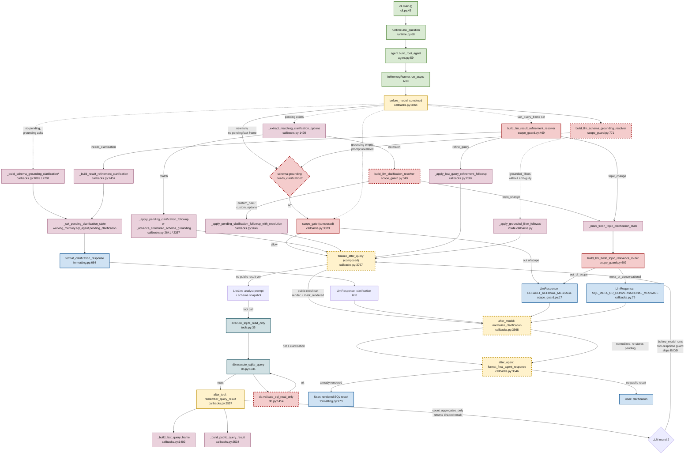

# CLAUDE.md

Operating manual for Claude coding sessions in the `agent-zoo` repo.
Not a user-facing README — the top-level [README.md](README.md) and [src/agent_zoo/sql_agent/README.md](src/agent_zoo/sql_agent/README.md) already cover that.

## Repo Overview

- Python package `agent-zoo` (`>=3.11`, setuptools, installable via `pip` or `uv`).
- Intended to be a collection of reusable Google ADK agents.
- Only the SQL agent under [src/agent_zoo/sql_agent/](src/agent_zoo/sql_agent/) is an actual working agent. The top-level package goal (a "zoo") is aspirational — most of the code lives there.
- Build/runtime layer is Google ADK (`google-adk[extensions]`); LLM calls go through `LiteLlm` and expect an **OpenAI-compatible endpoint** (e.g. `llama.cpp`, `vLLM`) via `OPENAI_API_BASE`.

## Current State Of The Repo

Substantive:
- [src/agent_zoo/sql_agent/](src/agent_zoo/sql_agent/) — complete, callback-driven NL→SQLite agent.
- [src/agent_zoo/scope_guard.py](src/agent_zoo/scope_guard.py) — reusable LLM-based scope gate + several LLM resolvers (clarification, fresh-topic router, refinement, schema grounding). Used by the SQL agent today; designed to be reusable by future agents.
- [src/agent_zoo/working_memory.py](src/agent_zoo/working_memory.py) — tiny helper for per-agent namespaced session state.
- [src/agent_zoo/base.py](src/agent_zoo/base.py) — minimal `BaseAgent` ABC (`name`, `description`, `ask`).
- [tests/](tests/) — mostly SQL-agent behavior, plus working-memory tests.
- [scripts/csv_to_sqlite.py](scripts/csv_to_sqlite.py) — stdlib-only CSV→SQLite builder used to produce the bundled Titanic dataset.

Placeholder / not implemented:
- [src/agent_zoo/data_analysis_agent/](src/agent_zoo/data_analysis_agent/) and [src/agent_zoo/orchestrator_agent/](src/agent_zoo/orchestrator_agent/) — empty apart from `.adk/session.db` and `__pycache__`. No `.py` source. Treat as reserved names, not working agents. Do not reference them in examples or docs as if they exist.

## Where The Real Logic Lives

The live SQL-agent runtime path is **`agent.py` + `runtime.py` + the callbacks wired into the `LlmAgent`**.

For a common change, look here first:

| Task | File |
| --- | --- |
| Change how the `LlmAgent` is assembled (model, tools, callbacks) | [src/agent_zoo/sql_agent/agent.py](src/agent_zoo/sql_agent/agent.py) |
| Change session handling, runner cache, CLI question flow | [src/agent_zoo/sql_agent/runtime.py](src/agent_zoo/sql_agent/runtime.py) |
| Change clarification, refinement, grounding, privacy, final-answer rendering behavior | [src/agent_zoo/sql_agent/callbacks.py](src/agent_zoo/sql_agent/callbacks.py) (~3k lines, the real control plane) |
| Change result shaping, privacy filtering, last-query-frame assembly, public result building | [src/agent_zoo/sql_agent/result_shaping.py](src/agent_zoo/sql_agent/result_shaping.py) |
| Change DB safety / read-only enforcement / SQL validation / schema summary / object-mode rewrite | [src/agent_zoo/sql_agent/db.py](src/agent_zoo/sql_agent/db.py) |
| Change user-visible response shape (clarifications, filter summaries, result payloads) | [src/agent_zoo/sql_agent/formatting.py](src/agent_zoo/sql_agent/formatting.py) |
| Change the system prompt / analyst rules / runtime context appended to it | [src/agent_zoo/sql_agent/instructions.py](src/agent_zoo/sql_agent/instructions.py) |
| Add/modify ADK tools exposed to the model | [src/agent_zoo/sql_agent/tools.py](src/agent_zoo/sql_agent/tools.py) |
| Change LLM scope/grounding/refinement resolver behavior | [src/agent_zoo/scope_guard.py](src/agent_zoo/scope_guard.py) |
| Change config/env-var handling, defaults | [src/agent_zoo/sql_agent/config.py](src/agent_zoo/sql_agent/config.py) |

There is also a **deep, accurate SQL-agent README** at [src/agent_zoo/sql_agent/README.md](src/agent_zoo/sql_agent/README.md). It is the best single reference for workflow stages, state keys, and resolver contracts — skim its Contents and jump into the relevant section before diving into `callbacks.py`.

## Setup / Environment

- Python 3.11+ required by [pyproject.toml](pyproject.toml). (`.python-version` pins `3.14`; the installed `.venv/` is what the test command below actually uses.)
- Two supported install flows per the README:
  - `uv` (preferred): `uv venv` then `uv pip install --python .venv/bin/python -e .` for local dev, or install from Git.
  - Plain `venv` + `pip`: slower full ADK dep resolution.
- `.env` is loaded by [src/agent_zoo/sql_agent/config.py](src/agent_zoo/sql_agent/config.py) via `python-dotenv`. Do not commit real secrets; do not print the existing `.env` contents in chat.
- This package expects an OpenAI-compatible LLM server. Point it at one with `OPENAI_API_BASE` (e.g. `http://127.0.0.1:8080/v1`). `OPENAI_API_KEY` is auto-filled with a placeholder when missing so LiteLLM does not reject the call.
- LLM model names are LiteLLM identifiers. Default is `openai/Qwen3.5-0.8B-GGUF`; override with `SQL_AGENT_MODEL`.

## Run / Test / Validate

Run the SQL agent (confirmed console entry point `run-sql-agent` → `agent_zoo.sql_agent.cli:main`):

```bash
# One-shot
uv run run-sql-agent --db dataset/titantic/titanic.sqlite --question "How many passengers survived?"

# Interactive
uv run run-sql-agent --db dataset/titantic/titanic.sqlite

# ADK-native dev UI (supported via ImportError fallbacks in agent.py/callbacks.py)
cd src && adk run agent_zoo/sql_agent
```

`--debug` prints the full ADK event stream and callback-level clarification tracing.

Tests — configured via `[tool.pytest.ini_options]` (`testpaths = ["tests"]`). The SQL-agent README's verified command uses `unittest`:

```bash
.venv/bin/python -m unittest discover tests -v
```

A `pytest` invocation over `tests/` is the conventional alternative, but prefer the verified `unittest` command when reproducing the repo's own workflow.

After any non-trivial behavior change in the SQL agent:
1. Run the full test suite. The test file `tests/test_sql_agent_db.py` covers DB safety, callbacks, clarification normalization, privacy, object-mode rewriting, and filter coverage — most regressions show up here.
2. If UI/response text changed, run at least one `run-sql-agent --db dataset/titantic/titanic.sqlite --question ...` to sanity-check the rendered output. The CLI prints deterministic rendered text; don't rely on the test suite alone for wording changes.

## SQL Agent Architecture Notes

- **Entry**: `SQLAgent.ask()` → `runtime.ask_question()` → builds `LlmAgent` via `build_root_agent()` → `InMemoryRunner` → ADK event loop.
- **Runner caching**: `runtime._RUNNER_CACHE` / `_INITIALIZED_SESSION_KEYS` keyed on a tuple of settings. Re-using the same settings reuses the runner and its session. If you change settings fields, update `runtime._runner_cache_key`.
- **Callbacks wired into the agent** (see `agent.py`):
  - `before_model_callback`: `build_combined_before_model_callback` — scope gate, clarification follow-up, fresh-topic routing, schema grounding, and finalize-after-query short-circuit.
  - `after_model_callback`: `build_normalize_clarification_after_model_callback` — collapses free-form clarifications into the canonical `{"response_type":"clarification", ...}` shape and stores a pending clarification in state.
  - `after_tool_callback`: `build_remember_query_result_callback` — persists a public/internal split of tool output into session state, builds `last_query_frame` for refinement memory, and (when `count_aggregates_only`) returns the shaped result directly as the tool response.
  - `after_agent_callback`: `build_format_final_agent_response_callback` — renders the deterministic final answer from the stored public query result.
- **State keys** live in `callbacks.py` as `SQL_*_STATE_KEY` constants (all `temp:` prefixed, e.g. `temp:sql_public_result`, `temp:sql_last_user_text`). Cross-turn working memory uses the `agent_working_memory` namespace via [working_memory.py](src/agent_zoo/working_memory.py).
- **Prompts**: `instructions.py::DEFAULT_INSTRUCTION` is the analyst-style system prompt; `build_agent_instruction()` appends the resolved DB path, runtime-config block, and live schema snapshot (including optional categorical-value guidance).
- **DB safety (`db.py`)**:
  - SQLite connections use `sqlite3.connect(<uri>, uri=True)` with a URI of the form `file://…?mode=ro`. Non-SELECT statements at runtime would fail, but the code also blocks them up front.
  - `validate_sql_read_only()` rejects empty SQL, multiple statements, and anything whose effective root keyword is not `SELECT`/`WITH` → `SELECT`. It then runs `EXPLAIN QUERY PLAN` against the read-only connection to catch schema-level errors before executing.
  - `execute_sqlite_query()` is the user-facing wrapper; it calls the validator, optionally rewrites CASE groups to surface a `'Null'` bucket, and can route through object-mode CTEs when `object_id_column` + `object_order_column` are set.
- **Scope gate / resolvers** (`scope_guard.py`): a set of `build_llm_*` factories returning callables that make a single low-token LiteLLM call and **fail open** on any error — do not change that fail-open semantics without a clear reason.

## Change Guidance

- Prefer minimal diffs. The SQL agent has a lot of invariants encoded across `callbacks.py`, `db.py`, and `formatting.py`; the test suite will usually catch accidental changes but subtle wording shifts can still escape.
- Preserve existing determinism: structured clarification JSON, result rendering via `format_public_query_result`, read-only validation, fail-open classifiers. Do not replace deterministic branches with free-form LLM calls.
- If you change any session-state schema, update both the writer (in `callbacks.py`) and any reader across `callbacks.py`/`scope_guard.py`, and update the tests.
- If you add a new ADK tool, register it in [tools.py](src/agent_zoo/sql_agent/tools.py) and add it to `build_sql_tools(...)`. Keep the tool docstring precise — ADK surfaces it to the model.
- Schema-driven behavior: categorical-value guidance, grounding, object-mode, and Null-bucket rewrites are all computed from `get_schema_summary(...)`. Do not hardcode dataset-specific columns. If a new dataset needs special handling, extend the schema-driven mechanism rather than special-casing.
- When changing the rendered response shape, keep `format_public_query_result` as the single rendering path. The `after_agent_callback` and the `after_tool_callback` short-circuit both end up there.
- Update docs/tests in the same change:
  - [src/agent_zoo/sql_agent/README.md](src/agent_zoo/sql_agent/README.md) is code-grounded — keep it truthful.
  - Top-level [README.md](README.md) is user-facing; do not surface internal state keys there.

## ADK-Specific Rules

- The repo-level instruction at [.github/copilot-instructions.md](.github/copilot-instructions.md) says to consult the `adk-docs-mcp` server as the primary source of truth for ADK behavior. Apply the same rule to Claude: if a question is about ADK callback lifecycle, `LlmAgent`/`LlmResponse` semantics, runner/session APIs, or MCP/tool plumbing, fetch ADK docs via the `adk-docs` MCP (`list_doc_sources` → `fetch_docs`) before editing.
- If the ADK docs MCP is unavailable, say so briefly, then fall back to local code inspection and mark any ADK-specific conclusion as tentative. Do not guess ADK behavior from training data when the repo evidence is thin.
- Note that [src/agent_zoo/sql_agent/callbacks.py](src/agent_zoo/sql_agent/callbacks.py) and [src/agent_zoo/sql_agent/agent.py](src/agent_zoo/sql_agent/agent.py) both have `try/except ImportError` blocks that support being loaded either as `agent_zoo.sql_agent...` (package) or as top-level `sql_agent` (ADK dev-UI run mode). Preserve both paths when adding new imports to these files.

## Common Pitfalls

- Mocking the LLM in ADK path tests: the existing approach (see `test_ask_question_reuses_cached_runner_for_same_session` in `tests/test_sql_agent_runtime.py`) patches `InMemoryRunner` + `build_root_agent` and clears `runtime._RUNNER_CACHE` / `_INITIALIZED_SESSION_KEYS`. Re-use that pattern instead of inventing a new fixture.
- `count_aggregates_only` is `True` by default. That changes the tool-response pathway: the `after_tool_callback` returns the shaped public result and the model never sees raw rows. If you're debugging "why did the model not see the rows?", check that flag first.
- The default DB path is literally `dataset/titantic/titanic.sqlite` — the misspelled directory `titantic` is load-bearing. Don't "fix" it as a typo without updating `config.DEFAULT_DB_PATH` and every reference in `README.md`, the SQL-agent README, and the scripts.
- `config.resolve_repo_path(...)` resolves relative paths against CWD first, then the project root. Absolute paths pass through unchanged. Keep this behavior when adding new path-valued settings.
- The scope gate and all LLM resolvers fail open — if a resolver throws or returns malformed JSON, behavior falls through to the main model path. Don't assume a classifier verdict is always present.
- Secrets live in `.env` (git-ignored via `.gitignore`). Never echo, cat, or paste the contents of `.env` into messages, commits, or PR descriptions.

## Execution Flow Reference

This section is an observation-only map of what the live SQL agent does on a user turn. No recommendations — see the README and `Where The Real Logic Lives` table above for pointers back to source.

### How the ADK lifecycle wires to our callbacks

One user turn can trigger multiple `before_model → (tool call → after_tool →) after_model` sub-rounds before the ADK runner finally emits `after_agent`. Our four wired callbacks (see [agent.py:69-72](src/agent_zoo/sql_agent/agent.py#L69-L72)):

| ADK hook | Factory | Role |
| --- | --- | --- |
| `before_model_callback` | `build_combined_before_model_callback` ([callbacks.py:3864](src/agent_zoo/sql_agent/callbacks.py#L3864)) | Dispatcher — inspects pending clarifications, last query frame, fresh-topic flag, then runs schema grounding, scope gate, and a finalize short-circuit. Can return an `LlmResponse` to skip the LLM call entirely. |
| `after_tool_callback` | `build_remember_query_result_callback` ([callbacks.py:3557](src/agent_zoo/sql_agent/callbacks.py#L3557)) | Captures the tool response into session state as a public/internal split, assembles `last_query_frame`, and (when `count_aggregates_only=True`, the default) returns the shaped public result back as the tool response so the model never sees raw rows. |
| `after_model_callback` | `build_normalize_clarification_after_model_callback` ([callbacks.py:3668](src/agent_zoo/sql_agent/callbacks.py#L3668)) | Inspects the model's text; if it looks like a clarification attempt, normalizes it into the canonical `{"response_type":"clarification", ...}` shape and stores a pending clarification. |
| `after_agent_callback` | `build_format_final_agent_response_callback` ([callbacks.py:3646](src/agent_zoo/sql_agent/callbacks.py#L3646)) | Final rendering gate: if a stored public result exists and hasn't been rendered yet, emits the deterministic rendered text; otherwise returns `None` to keep whatever text the ADK already has. |

Two more factories participate but are **not** wired directly by `agent.py`:

- `build_scope_gate_callback` ([callbacks.py:3823](src/agent_zoo/sql_agent/callbacks.py#L3823)) — composed inside `build_combined_before_model_callback` and invoked only when none of the earlier branches short-circuited.
- `build_finalize_after_query_before_model_callback` ([callbacks.py:3767](src/agent_zoo/sql_agent/callbacks.py#L3767)) — also composed inside `build_combined_before_model_callback`; every non-refusal branch returns through it so that when a public result is already stored, the LLM call is skipped and the rendered text is returned instead.

### State keys the dispatcher reads and writes

All stored in the ADK session `state`. `temp:` prefixed keys are turn-scoped; the `agent_working_memory` namespace (via [working_memory.py](src/agent_zoo/working_memory.py)) is cross-turn.

| Key / field | Purpose | Written by | Read by |
| --- | --- | --- | --- |
| `temp:sql_public_result` | Shaped, privacy-filtered result ready to render | `remember_query_result` (after_tool), `_build_public_query_result` | `finalize_after_query` (before_model), `format_final_agent_response` (after_agent) |
| `temp:sql_public_result_rendered` | Guard: public result already emitted this turn | `finalize_after_query`, `format_final_agent_response` | both of the above |
| `temp:sql_internal_query_result` | Raw tool rows (only when `capture_internal_rows=True`) | `remember_query_result` | debugging / tests |
| `temp:sql_last_user_text` | Last user turn text after topic-line extraction | combined before_model | clarification normalization, fresh-topic routing |
| `temp:sql_active_query_topic` | Current topic sentence used for clarification context | combined before_model | result-refinement + fresh-topic branches |
| `temp:sql_refinement_source_query_frame` | Snapshot of the query frame we'd be refining from | pending-clarification followup, last-query-frame refine path | next turn's `remember_query_result` to build `recent_refinement` |
| `temp:sql_fresh_topic_clarification` | Flag: upcoming clarification is a fresh topic | combined before_model (`_mark_fresh_topic_clarification_state`) | after_model normalization, combined before_model next turn |
| working memory → `pending_clarification` | Active clarification waiting on user reply | after_model normalization, schema-grounding branch in before_model | next turn's combined before_model (first branch) |
| working memory → `last_query_frame` | Last successful query's question/filters/aggregates | after_tool | combined before_model (result-refinement branch) |
| working memory → `recent_interpretation_clarification` | Clarification the user just resolved, one turn back | after clarification followup is applied | before_model (allow user to correct the interpretation on the next turn) |

### Scenario A — Clear, valid prompt

User enters `"How many passengers survived?"` at the CLI.

1. **Entry.** `main()` ([cli.py:45](src/agent_zoo/sql_agent/cli.py#L45)) → `_main_async` ([cli.py:21](src/agent_zoo/sql_agent/cli.py#L21)) → `ask_question(question, settings)` ([runtime.py:68](src/agent_zoo/sql_agent/runtime.py#L68)). If no cached runner for these settings, `ask_question` calls `build_root_agent(settings)` ([agent.py:59](src/agent_zoo/sql_agent/agent.py#L59)) and constructs an `InMemoryRunner`; session is created via `runner.session_service.create_session(...)` once per `(cache_key, session_id)`. The question is wrapped in `Content(role="user", parts=[Part(text=...)])` and handed to `runner.run_async(...)` ([runtime.py:99](src/agent_zoo/sql_agent/runtime.py#L99)).
2. **before_model (round 1).** ADK fires `combined(...)` ([callbacks.py:3898](src/agent_zoo/sql_agent/callbacks.py#L3898)). The request does not end with a tool response, so we enter the main dispatch: clear private result state, read user text, save `temp:sql_last_user_text` + `temp:sql_active_query_topic`. `_get_pending_clarification` returns `None`. `_get_last_query_frame` returns `None`. Fresh-topic flag is unset. The dispatcher proceeds to **schema grounding**: `_build_scope_gate_schema_context`, `_build_schema_grounding_catalog`, and `schema_grounding_resolver(...)` ([scope_guard.py:771](src/agent_zoo/scope_guard.py#L771)) are invoked. For an unambiguous question with a single obvious column (`survived`), the resolver typically returns either `{resolution_type: "grounded_filter"}` with no filter changes or no `resolution_items`; the dispatcher doesn't build a structured clarification and doesn't rewrite the request. Falls through to `scope_gate(...)` ([callbacks.py:3836](src/agent_zoo/sql_agent/callbacks.py#L3836)), which calls `classifier` built by `build_llm_scope_gate` ([scope_guard.py:301](src/agent_zoo/scope_guard.py#L301)). Verdict: in scope, returns `None`. `combined` ends with `return finalize(...)` — `SQL_PUBLIC_RESULT_STATE_KEY` is not set, so finalize also returns `None` and the LLM call proceeds.
3. **LLM round 1.** `LiteLlm` sends `instruction` (from [instructions.py](src/agent_zoo/sql_agent/instructions.py)) + the user turn. Model decides to call `execute_sqlite_read_only(sql="SELECT COUNT(*) AS matching_count FROM passengers WHERE survived = 1", is_final=True)` (the tool definition is in [tools.py:35](src/agent_zoo/sql_agent/tools.py#L35)).
4. **Tool execution.** `execute_sqlite_read_only` calls `execute_sqlite_query` ([db.py:1531](src/agent_zoo/sql_agent/db.py#L1531)), which runs `validate_sql_read_only` ([db.py:1454](src/agent_zoo/sql_agent/db.py#L1454)) (rejects empty SQL, multiple statements, non-SELECT root keywords, plus an `EXPLAIN QUERY PLAN` pass against a read-only connection), then executes against `sqlite3.connect(file://...?mode=ro, uri=True)`. Returns dict with `status="success"`, `rows`, `columns`, `row_count`, `sql`, `db_path`.
5. **after_tool.** `remember_query_result` ([callbacks.py:3568](src/agent_zoo/sql_agent/callbacks.py#L3568)) inspects the tool response. Because `is_final=True` and status is success, it builds `last_query_frame` via `_build_last_query_frame` ([callbacks.py:1402](src/agent_zoo/sql_agent/callbacks.py#L1402)) — filters, comparison filters, group columns, aggregate summary, and dataset-missing counts — and writes it to working memory. Then it builds the public result with `_build_public_query_result` ([callbacks.py:3534](src/agent_zoo/sql_agent/callbacks.py#L3534)) (which branches into `_build_aggregate_public_result` for a scalar count), attaches the `display_sql` and `query_summary_context`, and stores it at `temp:sql_public_result`. Because `count_aggregates_only=True` (default), the callback **returns the shaped public result as the tool response** — the model now sees the privacy-filtered view, not the raw rows.
6. **before_model (round 2).** `combined` fires again. `_request_ends_with_tool_response(llm_request)` is now True, so the whole B/C/D dispatch block at [callbacks.py:3900-4397](src/agent_zoo/sql_agent/callbacks.py#L3900) is skipped. `scope_gate_prechecked` stays False, but `scope_gate` itself also early-returns because of the same `_request_ends_with_tool_response` guard. `finalize(...)` ([callbacks.py:3767](src/agent_zoo/sql_agent/callbacks.py#L3767)) sees `temp:sql_public_result` is set, marks the result as rendered, and returns an `LlmResponse` with `format_public_query_result(...)` ([formatting.py:973](src/agent_zoo/sql_agent/formatting.py#L973)) output. **The LLM is not called in this round.**
7. **after_model.** `normalize_clarification_after_model` fires on the finalize response. The rendered text is not a function call and does not look like a clarification attempt, so `normalize_clarification_response` returns `None` and `looks_like_clarification_attempt` returns `False` → callback returns `None`, passing the text through.
8. **after_agent.** `format_final_agent_response` checks `_public_query_result_was_rendered`, which is True (finalize marked it), so it returns `None` — the already-rendered text is what the user sees.
9. **Exit.** `ask_question` collects the final event's text and returns it; `_main_async` prints it.

### Scenario B — Vague prompt, first clarification

User enters `"show me the data"`. Nothing to ground against.

1. **Entry** identical to A up through `combined` being fired.
2. **before_model.** `_get_pending_clarification` → None. `_get_last_query_frame` → None. Fresh-topic flag not set. Dispatch hits the schema grounding block at [callbacks.py:4254](src/agent_zoo/sql_agent/callbacks.py#L4254). `_build_schema_grounding_catalog` enumerates candidate columns/values; `schema_grounding_resolver` runs. Because the user text is generic (no column/value hints), the resolver either returns `resolution_type="needs_clarification"` with multiple candidate columns, or returns `resolution_items` describing field-level ambiguity.
   - If `resolution_items` are non-empty, `_build_schema_grounding_clarification_from_resolution_items` ([callbacks.py:2207](src/agent_zoo/sql_agent/callbacks.py#L2207)) yields a structured clarification (kind `schema_grounding_field_ambiguity` or `schema_grounding_value_ambiguity`). It's stored to `pending_clarification` via `_set_pending_clarification_state`, formatted via `format_clarification_response` ([formatting.py:664](src/agent_zoo/sql_agent/formatting.py#L664)), and returned as an `LlmResponse`.
   - Otherwise the resolver's "2+ candidate columns" path triggers `_build_schema_grounding_clarification` ([callbacks.py:1809](src/agent_zoo/sql_agent/callbacks.py#L1809)) with the same store-and-return pattern.
3. **No tool call and no LLM round.** The before_model short-circuited.
4. **after_model.** `normalize_clarification_after_model` runs on the clarification response. It re-parses the formatted text via `normalize_clarification_response` ([formatting.py:564](src/agent_zoo/sql_agent/formatting.py#L564)); the resulting clarification is stored again via `_set_pending_clarification_state` (redundant but idempotent — both the before_model branch and this callback write the same shape). `topic_context` + `query_context` + (optionally) `base_query_frame` are attached. Returns an `LlmResponse` with the (possibly re-formatted) text.
5. **after_agent.** `SQL_PUBLIC_RESULT_STATE_KEY` is not set → returns `None`. The clarification text is what the user sees.
6. **Exit.** User sees a clarification question with 1+ options; `pending_clarification` remains in working memory for the next turn.

### Scenario C — Vague follow-up to the clarification

User replies `"not sure, anything is fine"` (or similar — still vague, doesn't match any option).

1. **Entry** identical.
2. **before_model.** `_get_pending_clarification` now returns the state stored by Scenario B. The branch at [callbacks.py:3920](src/agent_zoo/sql_agent/callbacks.py#L3920) activates:
   - `is_structured_grounding_clarification` is True/False depending on what B produced.
   - `_extract_matching_clarification_options` ([callbacks.py:1498](src/agent_zoo/sql_agent/callbacks.py#L1498)) runs a deterministic substring/variant match over pending options. For `"anything is fine"` → `matched_options = []`, `has_option_match = False`.
   - Falls into the LLM resolver branch at [callbacks.py:3987](src/agent_zoo/sql_agent/callbacks.py#L3987): `_resolve_pending_clarification_reply` dispatches to `clarification_resolver` built by `build_llm_clarification_resolver` ([scope_guard.py:349](src/agent_zoo/scope_guard.py#L349)), which returns a dict with `resolution_type` ∈ `{topic_change, custom_rule, custom_options}`.
   - **`topic_change`** → mark fresh-topic flag, clear pending clarification, flow continues below into the fresh-topic router.
   - **`custom_rule` / `custom_options`** → for structured grounding, `_advance_structured_schema_grounding_clarification` ([callbacks.py:2357](src/agent_zoo/sql_agent/callbacks.py#L2357)) tries to advance the grounding queue; for non-structured, `_apply_pending_clarification_followup_with_resolution` ([callbacks.py:2649](src/agent_zoo/sql_agent/callbacks.py#L2649)) rewrites the last user turn and clears pending. In either case, control falls through to `finalize(...)`; no public result is stored yet, so `finalize` returns `None` and the rewritten request goes to the LLM. The LLM then either produces SQL (→ Scenario A from step 3 onward) or another clarification attempt (after_model normalizes it, stores a **new** pending clarification — this is how repeated clarification turns chain).
   - If the LLM resolver itself fails or returns malformed JSON (fail-open, per `scope_guard`), the default path is `custom_rule` with empty selections → effectively no rewrite, and control still falls through to the LLM for a retry.
3. **No explicit loop-guard.** There is **no** maximum clarification iteration counter in the codebase. Each turn looks at `pending_clarification` fresh; state is consumed and re-written on every attempt. A user can in principle keep giving vague replies and get a fresh clarification each turn. The only escape is (a) the user eventually picks an option or a custom rule the resolver can bind, (b) the user changes topic (→ fresh-topic router routes out-of-scope / meta / valid), or (c) the user session ends.
4. **Fresh-topic router** (only if `topic_change` was picked): [callbacks.py:4210-4252](src/agent_zoo/sql_agent/callbacks.py#L4210). `fresh_topic_router` from `build_llm_fresh_topic_relevance_router` ([scope_guard.py:692](src/agent_zoo/scope_guard.py#L692)) classifies the new text as one of `dataset_question` / `out_of_scope` / `meta_or_conversational`. `out_of_scope` returns `DEFAULT_REFUSAL_MESSAGE` ([scope_guard.py:17](src/agent_zoo/scope_guard.py#L17)); `meta_or_conversational` returns `SQL_META_OR_CONVERSATIONAL_MESSAGE` ([callbacks.py:79](src/agent_zoo/sql_agent/callbacks.py#L79)); `dataset_question` sets `scope_gate_prechecked = True` and continues into the schema-grounding block (which may itself produce a new clarification — still no iteration limit).
5. **Exit.** Either a new clarification, a refusal, a meta message, or (in the best case) a rendered result.

### Scenario D — Out-of-scope or unsafe prompt

Two sub-cases:

**D.1 — Out-of-scope prompt** (e.g. `"tell me a joke"`).

1. `combined` runs. Pending clarification / last query frame / fresh topic all empty → falls into schema grounding. The resolver has nothing to bind (no column/value evidence) and typically returns a generic needs_clarification or nothing. If nothing, the dispatcher falls through to `scope_gate` at [callbacks.py:4398](src/agent_zoo/sql_agent/callbacks.py#L4398).
2. `scope_gate(...)` invokes the `classifier` built by `build_llm_scope_gate`. For an unrelated prompt, verdict is `(allow=False, refusal=DEFAULT_REFUSAL_MESSAGE)` → returns `LlmResponse(...)` with refusal text.
3. **The LLM is never called** for the core task; only the low-token scope-gate classifier runs.
4. `after_model` sees the refusal text, it's not a clarification, returns `None`. `after_agent` has no public result → returns `None`. User sees the refusal.

**D.2 — Unsafe SQL** (e.g. user somehow coaxes `"DROP TABLE passengers"` from the model).

The scope gate normally catches the natural-language form first. But defense-in-depth is in the data layer:

1. If the LLM emits a `DROP`/`DELETE`/`UPDATE` call through `execute_sqlite_read_only`, the tool wrapper hands the SQL to `execute_sqlite_query` → `validate_sql_read_only` ([db.py:1454](src/agent_zoo/sql_agent/db.py#L1454)). The validator rejects: empty SQL, multiple statements (e.g. `"SELECT 1; DROP TABLE x"`), and anything whose effective root keyword is not `SELECT`/`WITH`→`SELECT`. It also runs `EXPLAIN QUERY PLAN` against a read-only connection, which would fail for DDL even if validation were bypassed.
2. The tool response has `status="error"` with a safe message. `remember_query_result` runs. Because `status != "success"` the last_query_frame branch is skipped, but `_build_public_query_result` still produces an error-shaped result and stores it. `count_aggregates_only` returns that error dict to the model.
3. The LLM now has an error response. It may retry with a valid SELECT or explain the error. If it retries, Scenario A resumes; if it produces text, after_model + after_agent pass it through.
4. Additionally, the SQLite connection is opened via `sqlite3.connect(<uri>, uri=True)` with `file://…?mode=ro` — even if validation were somehow bypassed, the connection itself would reject writes.

### Dependency graph (Scenarios A–D)

Top-to-bottom reads as Scenario A's happy path. Dashed edges mark the short-circuit branches for B, C, and D off `build_combined_before_model_callback`.



Nodes with a dashed border are reached by more than one scenario (the finalize/after_model/after_agent chain, `validate_sql_read_only`, the grounding resolver, the fresh-topic router, and the clarification resolver).

### Suspected dead code

**None verified.** A prior audit in this refactor flagged six private functions in `callbacks.py` as dead; direct `grep -rn` across `src/` and `tests/` showed every one of them had 2–6 live call sites inside `callbacks.py` itself. The list was a false positive. No symbols are currently flagged as unreachable from Scenarios A–D.

If a future audit produces candidates, verify each with `grep -rn "<name>" src/ tests/ --include="*.py"` and confirm only the `def` line matches before deleting.

### Duplication candidates

| Location A | Location B | Notes |
| --- | --- | --- |
| `db.py:95` `_normalize_whitespace` | `formatting.py:68` `_normalize_whitespace` | **Known and intentionally left alone** per prior decision — revisit only if a third copy appears. |

No other structural duplicates spotted in this pass.
