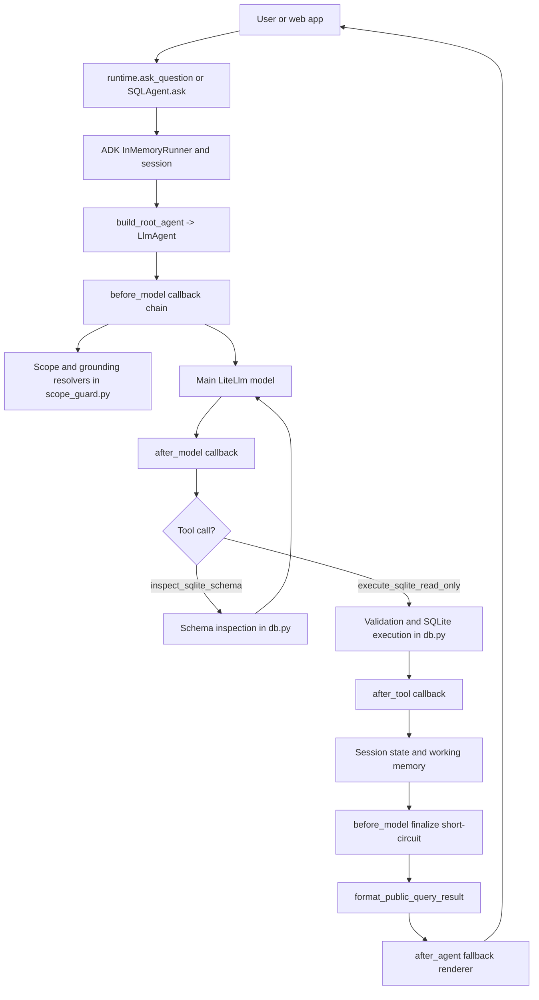
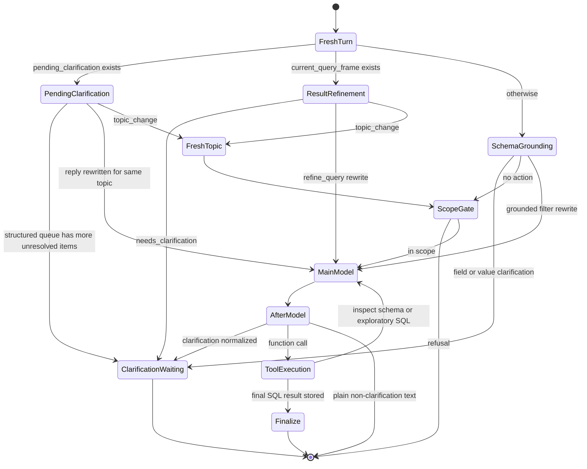
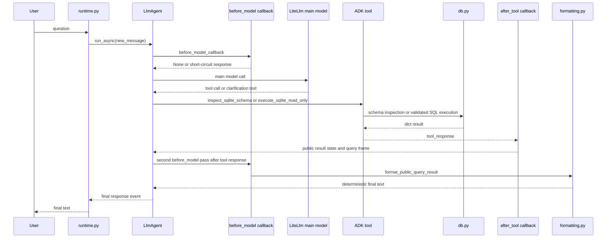
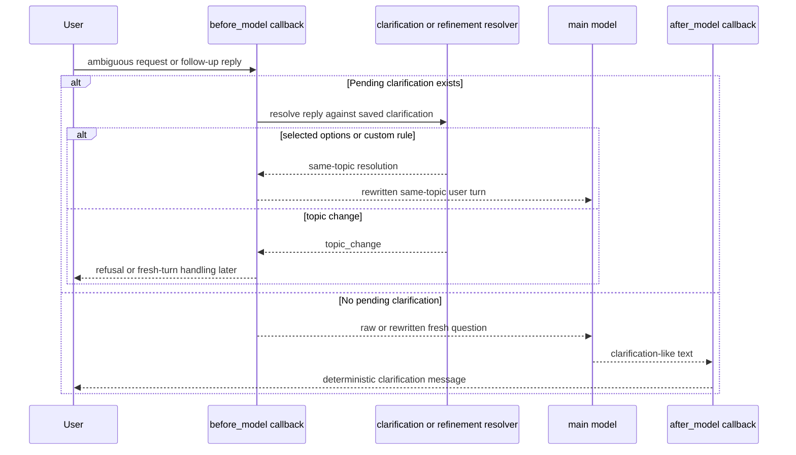
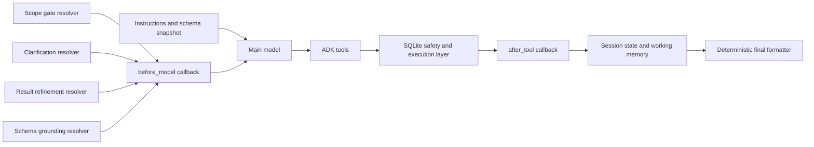

# SQL Agent

This README describes the actual SQL agent implementation in `src/agent_zoo/sql_agent`.

It is intentionally code-grounded:

- `Code-grounded` means the behavior is directly visible in the current implementation.
- `Test-grounded` means the behavior is asserted in `tests/test_sql_agent_db.py` or `tests/test_sql_agent_pipeline.py`.
- `Inference` means the behavior is a careful conclusion from the code path, not an explicit hard-coded branch.

ADK note:

- This package is built on Google ADK's `LlmAgent`, `InMemoryRunner`, session `state`, and callback lifecycle.
- The ADK-specific descriptions below are based on the local implementation plus the ADK callback, runtime, and session docs.
- This package does **not** use ADK's long-term `MemoryService`. Its cross-turn memory is a custom structure stored inside session state.

The most important mental model is this:

> This is **not** just a one-shot prompt that asks a model to write SQL.
>
> It is a callback-driven ADK agent where the main model is surrounded by deterministic Python logic and several sidecar LLM resolvers.
>
> Most of the workflow complexity lives in `callbacks.py`, not in `agent.py` or `instructions.py`.

## Contents

- [Mental Model](#mental-model)
- [Purpose and Boundaries](#purpose-and-boundaries)
- [Public Entry Points](#public-entry-points)
- [High-Level Architecture](#high-level-architecture)
- [Actual Workflow Stages](#actual-workflow-stages)
- [State Management](#state-management)
- [Context Management](#context-management)
- [Workflow Stages and Transition Conditions](#workflow-stages-and-transition-conditions)
- [Tool Usage](#tool-usage)
- [Error Handling and Typo Handling](#error-handling-and-typo-handling)
- [Prompt Examples Mapped to Real Paths](#prompt-examples-mapped-to-real-paths)
- [File and Module Map](#file-and-module-map)
- [Diagrams](#diagrams)
- [Developer Guide](#developer-guide)
- [Known Limitations](#known-limitations)
- [Glossary](#glossary)
- [Quick Run and Test Appendix](#quick-run-and-test-appendix)

## Mental Model

For onboarding, the simplest accurate mental model is:

1. A caller sends a natural-language question into `SQLAgent.ask(...)` or `runtime.ask_question(...)`.
2. ADK runs one `LlmAgent` with two actual ADK tools:
   - `inspect_sqlite_schema`
   - `execute_sqlite_read_only`
3. Before the main model call, a large `before_model_callback` decides whether the new turn is:
   - a fresh dataset question
   - a reply to a pending clarification
   - a refinement of the previous final SQL query
   - a fresh topic change that still needs routing before SQL flow continues
4. That callback may rewrite the latest user turn, advance a pending clarification queue, ask for clarification immediately, or refuse the request before the main model ever runs.
5. The main model either:
   - asks a clarification question
   - inspects schema
   - runs exploratory SQL
   - runs final SQL
6. After the model and tool calls, more callbacks normalize clarifications, capture tool results, build structured query memory, apply privacy shaping, and render the final answer deterministically.

Three code facts matter more than anything else:

- The live runtime path is the ADK path in `agent.py` + `runtime.py`, not `pipeline.py`.
- The real control plane is `callbacks.py` + `scope_guard.py`.
- The database safety layer is `db.py`.

## Purpose and Boundaries

### What the SQL agent is for

Code-grounded:

- The agent description in `agent.py` is: "Converts natural language questions into safe read-only SQLite queries and explains the results."
- The default instruction in `instructions.py` says the job is to choose the right tool calls and use only read-only SQLite `SELECT` or `WITH` queries.
- The instruction also says this agent is for **cohort-level aggregate answers** and should not return raw row-level detail unless the answer must degrade to a matching-count fallback.

In practical web-app terms, this agent is designed to answer questions like:

- counts of matching rows
- grouped counts
- aggregates such as `AVG`, `MIN`, and `MAX`
- grouped aggregates such as average age by category
- schema-grounded follow-up refinements of the previous SQL-backed answer
- clarification requests about nearby fields or categorical value choices

### What the SQL agent is designed to handle well

Code-grounded and test-grounded:

- Dataset-scoped questions that can be answered from the configured SQLite file.
- Questions that mention approximate, colloquial, or slightly incorrect dataset terminology.
- Questions that need clarification between nearby schema fields.
- Questions that need clarification between categorical values.
- Follow-up turns such as "include retired and student too" after a previous result.
- Follow-up turns that want to change the grouping structure of a previous grouped result, such as "use other categories instead".

### What the SQL agent should clarify

Code-grounded and test-grounded:

- When the request is still in scope but ambiguous.
- When more than one nearby schema field could match the request.
- When a colloquial label like `drink` could mean more than one categorical field.
- When one schema field is clear but the exact stored categorical values are still unresolved.
- When a user asks to broaden or change a previous categorical filter without naming the exact final value set.
- When the main model emits clarification-like text instead of a tool call.

### What the SQL agent should refuse or fail

Code-grounded:

- Out-of-scope questions are refused by the scope gate classifier in `scope_guard.py`.
- Topic-change replies that arrive during clarification or result-refinement first pass through a dedicated fresh-topic relevance router before they are treated as a new dataset query or refusal.
- Prompt injection style requests such as persona changes or instruction overrides are treated as out of scope by the scope-gate prompt.
- Destructive or administrative SQL is blocked by `validate_sql_read_only()` in `db.py`.
- Privacy-sensitive results can be converted into a count-only fallback or blocked entirely by the public-result shaping logic in `callbacks.py`.

### What the SQL agent does not do

Code-grounded:

- It does not write to the database.
- It does not use cross-session long-term memory.
- It does not guarantee automatic correction of typos via deterministic fuzzy matching.
- It does not implement a built-in handoff to another agent.
- It does not contain a custom orchestrator for routing off-topic requests elsewhere.

Important boundary for your web app:

- This package itself **refuses** out-of-scope requests.
- It does **not** call `orchestrator_agent` or another agent package when refusal happens.
- If you want off-topic questions handed to another subsystem, that handoff must happen outside this package.

## Public Entry Points

The package exposes several surfaces, but only some are part of the live runtime.

| Surface | Code | Role in the real system |
| --- | --- | --- |
| `SQLAgent.ask(question, **kwargs)` | `agent.py` | Thin wrapper that delegates to `runtime.ask_question(...)`. This is the cleanest programmatic integration point for a web app. |
| `ask_question(question, settings, runner=None, session_id=None)` | `runtime.py` | Real single-question runtime helper. Creates or reuses an `InMemoryRunner`, creates an ADK session if needed, streams events, and returns the final text. |
| `run_interactive_loop(settings)` | `runtime.py` | REPL-like local loop that deliberately reuses one runner and one session across turns. Useful for debugging multi-turn behavior. |
| `build_root_agent(settings)` | `agent.py` | Constructs the ADK `LlmAgent` with model, instruction, tools, and callbacks. |
| `root_agent` | `agent.py` | Import-time ADK-discoverable root agent object. Useful for `adk run` and `adk web`. |
| `run-sql-agent` CLI | `cli.py` | Thin shell over `load_settings(...)`, `ask_question(...)`, and `run_interactive_loop(...)`. |
| `run_nl_to_sql_pipeline(...)` | `pipeline.py` | Deterministic helper used by tests and support workflows. It is **not** the main live ADK runtime. |

Two integration details matter for a web app:

1. `SQLAgent.ask(...)` only preserves multi-turn context if the same runner/session is reused under the hood.
2. `runtime.ask_question(...)` caches runners by a settings-derived key and reuses the session id from settings unless the caller overrides it.

That means:

- same settings + same session id -> conversation state can survive
- different settings or a different session id -> state is effectively reset
- process restart -> all in-memory session state is lost

## High-Level Architecture



The shortest accurate summary is:

- `agent.py` wires the system together.
- `runtime.py` owns sessions and event streaming.
- `callbacks.py` is the state machine.
- `scope_guard.py` is the control-plane classifier layer.
- `db.py` is the safety and execution layer.
- `formatting.py` is the deterministic response renderer.

## Actual Workflow Stages

The table below names the real stages from code. Stage names use actual builder or helper functions whenever possible.

| Stage | Code location | Entered when | What it does | Main artifacts |
| --- | --- | --- | --- | --- |
| 1. Agent construction | `build_root_agent()` in `agent.py` | Agent build time | Creates `LlmAgent`, injects instruction, tools, and four callbacks | `LlmAgent` instance |
| 2. Session setup | `ask_question()` / `run_interactive_loop()` in `runtime.py` | Each user turn | Reuses or creates `InMemoryRunner`, creates session if needed, wraps user text in ADK `Content` | ADK session, event stream |
| 3. Fresh-turn preamble | `build_combined_before_model_callback()` in `callbacks.py` | Before model call, when request does not end with tool response | Clears old private result state, extracts the effective user question, stores current topic text | `temp:sql_last_user_text`, `temp:sql_active_query_topic` |
| 4. Pending clarification branch | same callback | Working memory contains `pending_clarification` | Resolves numeric, exact-text, or resolver-based clarification replies; structured schema-grounding clarifications can advance to the next unresolved item without calling the main model | rewritten latest user message or next clarification |
| 5. Recent interpretation replay | same callback | Working memory contains `recent_interpretation_clarification` | Allows one later selection-like reply to reuse interpretation options after a result turn | rewritten latest user message |
| 6. Result refinement branch | same callback | Working memory contains `current_query_frame` | Decides whether the new turn refines the previous query, needs clarification about a categorical filter or grouped structure, or starts a fresh topic | rewritten follow-up or pending clarification |
| 7. Fresh-topic relevance router | same callback + `build_llm_fresh_topic_relevance_router()` | A pending clarification or result-refinement reply was classified as `topic_change` | Distinguishes `dataset_question`, `meta_or_conversational`, and `out_of_scope` before fresh SQL flow continues | router decision or immediate response |
| 8. Schema grounding branch | same callback | Fresh dataset question with usable text | Builds schema candidate catalog, runs schema grounding resolver, enriches structured `resolution_items`, then either rewrites grounded filters or starts a sequential field/value clarification flow | rewritten question or pending clarification |
| 9. Scope gate | `build_scope_gate_callback()` via same callback | No earlier short-circuit blocked it | Runs dataset-scope classifier and returns refusal on out-of-scope prompts | refusal `LlmResponse` |
| 10. Main model step | ADK `LlmAgent` | `before_model_callback` returned `None` | Main model can ask clarification, inspect schema, run exploratory SQL, or run final SQL | plain text or function call |
| 11. Clarification normalization | `build_normalize_clarification_after_model_callback()` | Main model returned text, not a function call | Converts clarification-like text into deterministic clarification output and stores pending clarification | pending clarification + normalized clarification text |
| 12. Tool execution | `build_sql_tools()` -> `db.py` | Model issued an ADK tool call | Runs schema inspection or validated SQL execution | tool response dict |
| 13. Result capture | `build_remember_query_result_callback()` | Tool was `execute_sqlite_read_only` | Builds last query frame, public result, privacy shaping, and optional internal result state | working memory + temp public result |
| 14. Finalize short-circuit | `build_finalize_after_query_before_model_callback()` | A public result is already present before the next model step | Returns final structured SQL answer without another real model call | rendered final answer |
| 15. Fallback render | `build_format_final_agent_response_callback()` | Agent finishes and result was not already rendered | Final fallback formatter for the same public result contract | rendered final answer |

### What counts as success, pause, and failure

Successful completion:

- The model reaches a final `execute_sqlite_read_only(..., is_final=True)` call.
- `after_tool_callback` stores `temp:sql_public_result`.
- The finalize path renders `Generated SQL`, `Cohort filter summary`, and `Result`.

Paused completion waiting for user input:

- The main model asks for clarification.
- `after_model_callback` normalizes it and stores `pending_clarification`.
- The turn ends with a clarification message instead of a SQL result.

Failure or refusal completion:

- Fresh-topic router returns `meta_or_conversational` and the callback responds with a deterministic non-SQL guidance message.
- Fresh-topic router returns `out_of_scope` and the callback returns the standard refusal before schema grounding or the main model run.
- Scope gate returns out-of-scope refusal.
- SQL validation fails.
- SQLite execution fails.
- Privacy shaping blocks the result.
- The model produces unusable output and the turn degrades to a fixed clarification or error response.

### Where the workflow loops

There are two real loops, both spanning multiple turns inside the same session.

1. Clarification loop
   - pending clarification is stored
   - user replies later
   - `before_model_callback` either advances the next structured clarification item immediately or rewrites the new user turn as a continuation of the earlier request
   - the main model continues only after the clarification queue is resolved or the follow-up is rewritten

2. Result refinement loop
   - a final query stores `current_query_frame`
   - a later user turn such as `include retired too` is treated as a modification of the previous SQL-backed question
   - the callback rewrites the new user turn to include previous question, SQL, and filter context

There is **no** general-purpose automatic SQL retry loop in Python code.

What does retry-like work instead:

- multi-step schema grounding inside `build_llm_schema_grounding_resolver()`
- model-driven follow-up tool calls if the main model chooses to recover after seeing a tool result

## State Management

This is the part of the implementation that most strongly affects correctness.

### Ownership boundaries

The SQL agent uses four different kinds of state.

| State bucket | Owned by | Lives where | Lifetime | Purpose |
| --- | --- | --- | --- | --- |
| Agent configuration | SQL agent code | `SQLAgentSettings` object | Agent instance / runtime invocation | Static settings such as db path, model, privacy mode, and object-level mode |
| Session history and session state | ADK runtime | ADK `Session` created by `InMemoryRunner` | One conversation session | Chronological event history plus mutable session state |
| SQL-agent working memory | Custom helper layer in `working_memory.py` | Nested under `session.state['agent_working_memory']['sql_agent']` | One conversation session | Cross-turn structured memory for clarifications and last query context |
| Local callback variables | Python call stack | callback/resolver functions | One function call | Temporary decision state such as matched options or grounded filters |

Important distinction:

- This package uses **ADK session state**.
- It does **not** use ADK `MemoryService`.
- The `working memory` here is a custom dict stored inside session state, not a separate ADK memory subsystem.

### Configuration state: `SQLAgentSettings`

`SQLAgentSettings` is the only class-level runtime configuration container in this package.

| Field | Used by | Effect on behavior |
| --- | --- | --- |
| `db_path` | `instructions.py`, `tools.py`, `db.py`, `runtime.py` | Chooses the SQLite file used for schema inspection and execution |
| `model` | `agent.py`, `scope_guard.py` builders | Chooses both the main LiteLLM model and the sidecar resolver model |
| `openai_api_base` | `agent.py` | Sets `OPENAI_API_BASE` before model construction |
| `debug` | `runtime.py`, `callbacks.py`, `scope_guard.py` | Enables debug prints and extra resolver debug labeling |
| `instruction_file` | `instructions.py` | Replaces the default instruction text if present |
| `preview_rows` | `tools.py`, `db.py` | Caps result previews and affects truncation behavior |
| `count_aggregates_only` | `callbacks.py`, `runtime.py` | Enables privacy-shaped public results and debug redaction of tool responses |
| `minimum_aggregate_count` | `callbacks.py` | Sets privacy threshold for scalar and grouped aggregates |
| `capture_internal_rows` | `callbacks.py` | Stores raw internal query results in temp state |
| `include_categorical_value_guidance` | `instructions.py`, `tools.py`, `callbacks.py` | Includes low-cardinality stored values in schema summaries and prompts |
| `max_categorical_values` | `db.py`, `instructions.py`, `tools.py`, `callbacks.py` | Caps how many categorical values are surfaced per column |
| `object_id_column` | `config.py`, `db.py` | Enables object-level canonicalization of result queries |
| `object_order_column` | `config.py`, `db.py` | Adds stable ordering to object-level canonicalization |
| `app_name`, `user_id`, `session_id` | `runtime.py` | Identify the ADK app/session and influence runner reuse |

### ADK session history and what the code relies on

ADK docs describe a `Session` as the current conversation thread containing event history and mutable session state. That is exactly how this package behaves:

- `runtime.ask_question(...)` calls `runner.run_async(...)` with `user_id`, `session_id`, and a new `Content` object.
- ADK keeps the event history for that session.
- The SQL agent does **not** manually rebuild older chat turns into a new prompt string on each turn.

Instead, the code relies on a mix of:

- ADK-managed event history
- session state keys
- custom working memory
- explicit rewriting of the latest user turn before the next model call

### Session-state keys used by this package

These keys live directly in `callback_context.state` or `tool_context.state`.

| Key | Set by | Meaning | Typical lifetime |
| --- | --- | --- | --- |
| `temp:sql_public_result` | `build_remember_query_result_callback()` | Final public result contract used for deterministic rendering | Current turn, cleared at next fresh-turn preamble |
| `temp:sql_public_result_rendered` | finalize callbacks | Marks that the public result was already rendered once | Current turn |
| `temp:sql_internal_result_ref` | `build_remember_query_result_callback()` | Points at which temp key contains internal query data | Current turn |
| `temp:sql_internal_query_result` | `build_remember_query_result_callback()` when `capture_internal_rows=True` | Raw internal query result dict | Current turn |
| `temp:sql_last_user_text` | `build_combined_before_model_callback()` | Last extracted terminal user question text | Session-scoped until overwritten |
| `temp:sql_active_query_topic` | `build_combined_before_model_callback()` and follow-up paths | Current active query topic after rewrites | Session-scoped until overwritten |
| `temp:sql_refinement_source_query_frame` | refinement and clarification follow-up paths | Previous query frame used while applying a refinement | Current turn or until consumed |
| `temp:sql_fresh_topic_clarification` | clarification and refinement topic-change paths | Flag meaning the current turn has already been reclassified as a fresh topic and should go through fresh-topic routing / fresh-topic clarification handling instead of inheriting the old query frame | Very short-lived; explicitly consumed and cleared |

How these keys are reset:

- `_clear_private_result_state(...)` clears the public/internal result keys at the start of a fresh turn.
- `_clear_fresh_topic_clarification_state(...)` clears the fresh-topic flag when consumed.
- `temp:sql_last_user_text` and `temp:sql_active_query_topic` are overwritten every new turn.

### Custom working memory

`working_memory.py` stores one nested snapshot per agent namespace under:

```python
session.state['agent_working_memory']['sql_agent']
```

This package currently uses three fields there.

| Working-memory field | Meaning | Set by | Cleared by |
| --- | --- | --- | --- |
| `pending_clarification` | The clarification the user still needs to answer | `build_normalize_clarification_after_model_callback()` and some pre-model clarification builders | Cleared after successful follow-up resolution or topic change |
| `current_query_frame` | Structured summary of the last committed final query | `build_remember_query_result_callback()` | Replaced by the next committed final query or removed manually |
| `recent_interpretation_clarification` | Short-lived copy of an interpretation clarification that may survive one later selection-like reply | `before_model_callback` after certain follow-up resolutions | Cleared after reuse or when deemed stale |

### `current_query_frame`: what exactly is saved

`_build_last_query_frame(...)` constructs the saved query frame from:

- `SQL_ACTIVE_QUERY_TOPIC_STATE_KEY` or `SQL_LAST_USER_TEXT_STATE_KEY`
- `tool_response['display_sql']` if present
- otherwise the tool args SQL or executed SQL

The saved frame can include these fields:

| Field | Meaning |
| --- | --- |
| `question` | Current committed dataset question/topic |
| `sql` | User-visible SQL, preferring `display_sql` when present |
| `categorical_filters` | Extracted categorical filters found in SQL, with `selected_values`, `available_values`, and optional overall missing or blank count metadata for final cohort filter summary rendering |
| `comparison_filters` | Extracted comparison filters such as `age > 46` |
| `is_grouped` | Boolean flag showing that the saved query was a grouped query |
| `group_columns` | Grouping columns inferred from the committed grouped query |
| `topic_context` | Multi-line text summary built from the frame and reused by refinement logic |
| `recent_refinement` | Optional summary of recent categorical additions/removals |

Two important consequences:

1. The query frame is **not** the full previous tool result.
2. It is a structured summary optimized for follow-up refinements and final rendering.

### `pending_clarification`: what exactly can be saved

The pending clarification payload is a dict. Depending on the path that created it, it may contain:

| Field | Meaning |
| --- | --- |
| `user_message` | User-facing clarification question |
| `options` | Clarification options after normalization |
| `clarification_kind` | One of `categorical_values`, `generic`, or `interpretation` |
| `topic_context` | Current question/topic text |
| `query_context` | Previous query frame topic summary when a clarification belongs to an earlier committed query |
| `base_query_frame` | Copy of the prior committed query frame, used when refinement must continue after clarification |
| `option_columns` | Mapping from displayed interpretation option label back to exact schema column identifier |
| `grounded_filters` | Already grounded categorical filters from the original request |
| `grounding_resolution_items` | Internal structured schema-grounding queue used to continue unresolved field/value clarifications across turns |
| `grounding_current_item_index` | Internal pointer to the currently active structured schema-grounding item |
| `grouping_change_request` | Raw grouped-structure change request preserved when a follow-up needs clarification about a new grouping field |

When `grounding_resolution_items` is present, the callbacks treat the clarification as a structured schema-grounding continuation rather than a one-shot menu. Exact option matches or resolver-based free-text replies update the current item, then the callback either emits the next clarification immediately or rewrites the same dataset question once all unresolved items are resolved.

### What is persistent across turns vs not

Persistent across turns in the **same ADK session**:

- ADK event history
- `temp:sql_last_user_text`
- `temp:sql_active_query_topic`
- custom working memory
- last committed query frame
- pending clarification state

Not persistent across sessions or process restarts:

- all of the above, because `InMemoryRunner` uses in-memory session services in this package

Not custom-persisted even within a session:

- model chain-of-thought
- a separate transcript of clarification answers
- a durable cross-session memory store

### Does the agent store conversation history, schema context, tool results, and intent interpretations?

Yes, but not all in the same way.

| Artifact | Stored? | Where |
| --- | --- | --- |
| Conversation history | Yes | ADK session events |
| Last user topic text | Yes | `temp:sql_last_user_text` |
| Active rewritten topic | Yes | `temp:sql_active_query_topic` |
| Full raw tool result | Optionally | `temp:sql_internal_query_result` when `capture_internal_rows=True` |
| Public query result | Yes, for current turn | `temp:sql_public_result` |
| Previous final query summary | Yes | `current_query_frame` in working memory |
| Clarification state | Yes | `pending_clarification` in working memory |
| Recent interpretation menu | Yes, short-lived | `recent_interpretation_clarification` |
| Schema snapshot | Not as mutable state; rebuilt as needed | instruction text and schema summaries |
| Intermediate reasoning text | No intentional structured store | callback normalization tries to strip it |

### How state gets discarded

Code-grounded:

- Starting a fresh turn clears public/internal result temp keys.
- Resolving a clarification clears `pending_clarification`.
- Topic change clears `pending_clarification`, marks a fresh-topic flag, and routes the new turn through the fresh-topic relevance router.
- Fresh-topic replies classified as `meta_or_conversational` or `out_of_scope` restore the earlier topic state instead of promoting the new non-dataset turn as the active query topic.
- Reusing recent interpretation clarification clears that recent copy.
- New final queries overwrite `current_query_frame`.
- New sessions start empty unless the caller preloads session state externally.

## Context Management

This section answers: what does the model see, at which point, and why?

### Main model context

The main ADK `LlmAgent` model sees a combination of build-time instruction, ADK session history, tool outputs, and the current user turn.

#### Build-time instruction assembled in `instructions.py`

`build_agent_instruction(settings)` concatenates:

1. `DEFAULT_INSTRUCTION`
2. runtime context fields such as db path and preview rows
3. schema snapshot from `get_schema_summary(...)`
4. optional categorical value guidance section

That means the main model starts every session with:

- rules for tool order and SQL generation
- the configured database path
- privacy-related settings
- a schema snapshot
- low-cardinality stored values when enabled

This is why the model often does **not** need to call `inspect_sqlite_schema` before its first SQL attempt, even though the instruction tells it to inspect schema when unsure.

#### Current user turn content

The current user turn can reach the model in three different shapes.

1. Raw fresh question
   - Example: `how many females drink`

2. Rewritten clarification follow-up
   - The callback rewrites the latest user turn into a structured continuation of the earlier question.
   - The rewritten text can include:
     - the previous clarification question
     - available options
     - matched options from numeric or text replies
     - already grounded filters
     - resolved schema fields from interpretation replies
     - the raw user reply

3. Rewritten result refinement follow-up
   - The callback rewrites the latest user turn into a continuation of the previous committed query.
   - The rewritten text can include:
     - previous dataset question
     - previous SQL
     - prior categorical filters
     - updated categorical value set
     - same-query refinement request text

That latest rewritten user message is one of the most important context-construction mechanisms in the package.

#### ADK session history

The code does not manually concatenate previous chat turns into the prompt, but ADK session history still exists for the main model because `run_async(...)` is called against a session id.

What the SQL-agent code itself explicitly depends on, beyond ADK history:

- last extracted user topic
- saved clarification state
- saved query frame
- tool response state for the current turn

### Secondary resolver context

The package also makes separate LiteLLM calls in `scope_guard.py`. These are **not** ADK tools. They are extra control-plane LLM calls used before the main model or in follow-up routing.

| Resolver | Inputs it sees | Purpose |
| --- | --- | --- |
| `build_llm_scope_gate()` | schema text + latest effective user text | Decide `IN_SCOPE` vs `OUT_OF_SCOPE` |
| `build_llm_clarification_resolver()` | topic context, clarification question, options, latest reply | Decide `selected_options`, `custom_rule`, or `topic_change` |
| `build_llm_fresh_topic_relevance_router()` | schema text, previous committed dataset topic if any, latest reply already classified as `topic_change` | Decide `dataset_question`, `meta_or_conversational`, or `out_of_scope` |
| `build_llm_result_refinement_resolver()` | previous question, topic context, previous SQL, categorical filters, grouping columns, recent refinement history, latest reply | Decide `refine_query`, `needs_clarification`, or `topic_change` |
| `build_llm_schema_grounding_resolver()` | latest user request, schema column previews, grounding candidates, candidate column identifiers | Decide grounded filters, reviewed field resolutions, and structured `resolution_items` for unresolved field/value ambiguity |

### Schema-grounding context in particular

Fresh-turn schema grounding is richer than a simple column-name match.

`_build_schema_grounding_catalog(...)` constructs:

- schema column identifiers
- optional human-readable labels from `source_header`
- optional field glossary labels parsed from an upstream `Field glossary:` block in the wrapped prompt
- categorical value candidates from `categorical_values`
- lexical evidence from `_build_grounding_variants(...)`

The grounding variants helper expands text into:

- the normalized full phrase
- individual tokens
- simple singularized token variants

This matters for colloquial prompts such as `guys`, plural labels, and field glossary terms.

### Schema-grounding resolver contract

Fresh-turn schema grounding is now a two-part contract owned jointly by `scope_guard.py` and `callbacks.py`.

`build_llm_schema_grounding_resolver()` returns a coarse top-level decision that can include:

- `resolution_type`
- `grounded_filters`
- `candidate_columns`
- `resolved_columns`
- `resolution_items`

`resolution_items` is the structured payload that describes how the request decomposes into schema-linked parts. Each item uses this shape:

- `matched_phrase`
- `ambiguity_kind`
- `selected_column`
- `selected_values`
- `candidate_columns`
- `candidate_values`

The current item kinds are:

- `grounded_filter`: one exact column and one or more exact stored values are already grounded
- `field_ambiguity`: the phrase could still refer to two or more schema columns
- `value_ambiguity`: one column is clear, but the exact stored value set is still unresolved

The resolver owns the coarse decision and first-pass itemization. The callback layer then enriches those items with schema-backed display labels and fallback candidate values, stores them in `pending_clarification`, and asks unresolved items sequentially.

Important nuance:

- The callback layer is still the final authority for user-visible clarification flow.
- Some `proceed` results can carry `resolved_columns` even when the final clarification still needs exact stored values.
- In that case, callbacks may derive the value-level clarification from the schema catalog even if the resolver only emitted grounded-filter items.

### After-model clarification context

When the main model returns clarification-like text instead of a function call, `build_normalize_clarification_after_model_callback()` sees:

- raw model text
- categorical value guidance from `get_schema_summary(...)`
- current topic text from `temp:sql_last_user_text`
- optional query context and base query frame when the clarification belongs to an existing committed query

It then:

- parses JSON if possible
- extracts embedded JSON if the model mixed prose with a trailing JSON object
- falls back to heuristics when needed
- clamps options to exact dataset categorical values when guidance strongly matches
- strips topic echo, reasoning pollution, and SQL/prose debris from the option list
- stores a normalized pending clarification payload

### Final rendering context

No LLM is involved in final formatting once a public result exists.

`format_public_query_result(...)` renders from the callback-owned public result dict, which can include:

- `display_sql`
- public rows
- aggregate column metadata
- `matched_row_count`
- `public_result_kind`
- `grouped_result_suppressed`
- `query_summary_context`

That is how the final answer stays deterministic even if the model earlier produced messy prose.

### What is and is not included at each point

| Context item | Main model | Scope gate | Clarification resolver | Result refinement resolver | Schema grounding resolver | Final formatter |
| --- | --- | --- | --- | --- | --- | --- |
| ADK session history | Yes, ADK-managed | No | No | No | No | No |
| Static instruction text | Yes | No | No | No | No | No |
| Schema snapshot | Yes | Yes, as classifier system prompt context | No | No | Yes | No |
| Categorical value guidance | Yes, in instruction when enabled | No | No | Via saved query frame values only | Yes, via schema summary candidates | Indirectly via `query_summary_context` |
| Latest user turn | Yes | Yes | Yes | Yes | Yes | No |
| Previous clarification question/options | Only if pre-model rewrite inserted them | No | Yes | No | No | No |
| Previous final SQL | Only if pre-model refinement rewrite inserted it | No | No | Yes | No | No |
| Prior tool errors | Only if present in ADK session history | No | No | No | No | No |
| Saved query frame | Indirectly, via rewrites | No | Sometimes via `query_context` | Yes | No | Yes, via `query_summary_context` |
| Public result | Not directly, except through tool response history and later formatter | No | No | No | No | Yes |

## Workflow Stages and Transition Conditions

This section focuses on the actual branch conditions that move the request from one stage to another.

### 1. Fresh-turn preamble

Code path:

- `build_combined_before_model_callback()`

Entry condition:

- request does **not** end with a tool response

What enters:

- the latest ADK `llm_request`
- callback session state

What happens:

- clear stale public/internal result state
- clear stale fresh-topic flag
- extract raw latest user text and effective topic text
- store topic in `temp:sql_last_user_text` and `temp:sql_active_query_topic`

Moves on to:

- pending clarification logic if `pending_clarification` exists
- otherwise recent interpretation reuse, result refinement, schema grounding, or scope gate

### 2. Pending clarification follow-up resolution

Code path:

- `_get_pending_clarification(...)`
- `_extract_matching_clarification_options(...)`
- `_resolve_pending_clarification_reply(...)`
- `_advance_structured_schema_grounding_clarification(...)`
- `_apply_pending_clarification_followup_with_resolution(...)`

Entry condition:

- working memory contains `pending_clarification`

Actual transition conditions:

- If the clarification is carrying a structured schema-grounding queue and the reply resolves the current item, the callback can emit the next unresolved clarification immediately without calling the main model.
- If the reply exactly matches option text or deterministically matches numeric option indexes like `2`, `2 and 3`, or `2,3`, the callback rewrites the latest user turn immediately.
- If there is no exact or numeric match, it calls `build_llm_clarification_resolver()`.
- Resolver outcome `selected_options` -> rewrite follow-up and continue.
- Resolver outcome `custom_rule` -> rewrite follow-up and continue.
- Resolver outcome `topic_change` -> clear pending clarification, mark fresh topic, and route through the fresh-topic relevance router.

Outputs:

- next clarification response when a structured schema-grounding queue still has unresolved items
- rewritten latest user turn containing clarification question, matched options or custom rule, and raw reply
- cleared pending clarification state when successfully resolved

Notable behavior:

- selection-like clarification replies bypass the scope gate for that turn
- query-context is preferred over topic-context when present

### 3. Recent interpretation clarification replay

Code path:

- `_get_recent_interpretation_clarification(...)`

Entry condition:

- no active pending clarification, but recent interpretation clarification exists

Actual transition condition:

- if the latest reply matches one or more of those saved interpretation options, the callback rewrites the turn and continues without scope gating

Purpose:

- allow one later numeric selection after a result turn to still resolve a previous interpretation menu

### 4. Result refinement routing

Code path:

- `_get_last_query_frame(...)`
- `_resolve_recent_refinement_followup(...)`
- `build_llm_result_refinement_resolver()`
- `_build_result_refinement_clarification(...)`
- `_apply_last_query_refinement_followup(...)`

Entry condition:

- working memory contains `current_query_frame`

Actual transition conditions:

- Deterministic refinement helper runs first when it can handle the reply directly.
- Otherwise the result-refinement resolver returns one of:
  - `needs_clarification`
  - `refine_query`
  - `topic_change`

Branch outcomes:

- `needs_clarification` -> build a deterministic clarification using the previous query frame. If `target_column` is present, this is a categorical-value clarification over that filter column's available values. If `target_column` is empty but the saved query was grouped, this becomes a grouped-structure clarification asking which exact field or category should replace the previous grouping column. If neither specific clarification can be built, the callback falls back to a fixed generic clarification rather than silently degrading into a same-query rewrite.
- `refine_query` -> rewrite latest user turn with previous question, previous SQL, previous categorical filters, updated value set, and refinement request text.
- `topic_change` -> mark fresh-topic flag and let the turn continue through the fresh-topic relevance router before it is treated as a new dataset question or refusal.

Important grouped-query nuance:

- grouped final queries now save their grouping columns inside `current_query_frame`
- this lets later structural follow-ups stay inside clarification flow instead of collapsing into a malformed generic refinement
- the current grouped clarification path is intentionally conservative: it asks for the exact replacement grouping field or category instead of inventing menu options from the previous grouped result

### 5. Fresh-topic relevance router

Code path:

- `build_llm_fresh_topic_relevance_router()` invoked only when `temp:sql_fresh_topic_clarification` is set

Entry condition:

- a previous clarification or refinement reply was classified as a topic change

Purpose:

- distinguish a fresh dataset question from conversational/meta turns and true out-of-scope turns before SQL flow continues

Router outcomes:

- `dataset_question` -> continue into fresh-turn schema grounding and skip the binary scope gate for this topic-change branch.
- `meta_or_conversational` -> return a deterministic non-SQL guidance message and restore the earlier active topic state.
- `out_of_scope` -> return the standard refusal and restore the earlier active topic state.

What `meta_or_conversational` means in this codebase:

- a turn about the interaction rather than a new dataset request
- examples include acknowledgements, conversational replies, or questions about the prior conversation rather than the dataset itself
- it is explicitly **not** treated as a SQL question, but it is also not treated as a hostile or unrelated out-of-scope request

Important nuance:

- This is **not** the normal first-turn order.
- Normal first-turn schema grounding still happens before the normal scope gate.
- The fresh-topic router is a special branch used only after clarification/result-refinement already said `topic_change`.

### 6. Fresh-turn schema grounding

Code path:

- `_extract_request_field_glossary(...)`
- `_build_schema_grounding_catalog(...)`
- `build_llm_schema_grounding_resolver()`
- `_enrich_grounding_resolution_items(...)`
- `_build_schema_grounding_clarification_from_resolution_items(...)`
- `_advance_structured_schema_grounding_clarification(...)`
- `_normalize_schema_grounding_filters(...)`
- `_build_schema_grounding_clarification(...)`
- `_apply_grounded_filter_followup(...)`

Entry condition:

- fresh user turn with usable text, no earlier short-circuit

Actual transition conditions:

- Resolver returns unresolved structured `resolution_items` -> callbacks enrich them and ask the first unresolved field or value clarification.
- User replies to that structured clarification -> callbacks may ask the next unresolved item immediately without calling the main model.
- Resolver returns grounded filters and no remaining unresolved item -> rewrite latest user turn with those grounded filters and continue.
- Resolver returns `resolved_columns` for a clearly chosen field but exact stored values are still unresolved -> callbacks can derive a value clarification from the schema catalog before SQL generation continues.
- Resolver returns no action -> fall through to scope gate.

What triggers clarification here:

- unresolved field-level ambiguity between two or more candidate schema columns
- unresolved value-level ambiguity inside one already chosen schema field
- multi-concept requests where one concept is already grounded and another still needs clarification

What does **not** trigger this clarification:

- fully resolved grounded filters with no remaining unresolved field or value choice

### 7. Scope gate

Code path:

- `build_llm_scope_gate()`
- `build_scope_gate_callback()`

Entry condition:

- no earlier branch already returned clarification, refusal, or rewrite-only continuation

Important nuance:

- For ordinary fresh user turns, schema grounding still runs before the scope gate.
- For topic-change turns already classified as `dataset_question` by the fresh-topic router, the callback skips the binary scope gate and continues directly into schema grounding / main-model flow.

Actual transition conditions:

- classifier returns `OUT_OF_SCOPE` -> callback returns refusal `LlmResponse`
- classifier returns `IN_SCOPE` or fails open -> allow normal model flow

Important scope-gate behavior from prompt and tests:

- schema-adjacent wording, approximate terms, colloquialisms, and near-match references are intentionally treated as in scope so the main agent can clarify instead of refusing

### 8. Main model step

Code path:

- ADK `LlmAgent` main model call

Entry condition:

- `before_model_callback` returned `None`

Possible next actions:

- ask clarification before querying
- call `inspect_sqlite_schema`
- call `execute_sqlite_read_only(..., is_final=False)` for exploratory SQL
- call `execute_sqlite_read_only(..., is_final=True)` for final SQL

What is code-enforced vs instruction-enforced here:

- tool choice order is mostly instruction-enforced
- read-only execution safety is code-enforced by `db.py`

### 9. Clarification normalization after model output

Code path:

- `build_normalize_clarification_after_model_callback()`

Entry condition:

- main model returned plain text instead of a function call

Actual transition conditions:

- plain text does not look like a clarification attempt -> do nothing
- clarification JSON or parseable clarification-like text -> normalize and store pending clarification
- clarification-like text that cannot be normalized confidently -> fall back to one fixed clarification prompt with no inferred options

Normalization hardening details:

- fallback option extraction intentionally rejects SQL-looking lines, markdown table debris, and generic prose scaffolding such as "previous query" or "latest user reply"
- this prevents malformed model explanations from turning into junk numbered clarification menus

### 10. Tool execution

Actual tool branches:

- `inspect_sqlite_schema` -> schema summary dict
- `execute_sqlite_read_only` -> validated execution result dict

Notable transition condition:

- `is_final=False` marks exploratory SQL; callbacks intentionally do **not** promote that result to final public state

### 11. Result capture after tool execution

Code path:

- `build_remember_query_result_callback()`

Entry condition:

- tool is `execute_sqlite_read_only`

Actual transition conditions:

- if tool result is exploratory (`is_final=False`), do not store final public result; let model continue
- if final tool result is successful, build `current_query_frame` and `temp:sql_public_result`
- if privacy mode is on, return the public result dict back into the ADK tool-response flow

### 12. Final answer generation

Code paths:

- primary: `build_finalize_after_query_before_model_callback()`
- fallback: `build_format_final_agent_response_callback()`

Entry condition:

- `temp:sql_public_result` exists

Actual transition conditions:

- if result already rendered -> fallback callback returns `None`
- if not rendered yet -> formatter returns deterministic SQL result content

Final answer format:

1. `Generated SQL`
2. `Cohort filter summary`
3. `Result`
4. optional privacy note

## Tool Usage

### Actual ADK tools

The SQL agent registers exactly **two** ADK tools in `build_sql_tools(settings)`.

| Tool | Inputs | Output | Called during | Why it is called | Failure behavior | Mutates state? |
| --- | --- | --- | --- | --- | --- | --- |
| `inspect_sqlite_schema` | `db_path: str | None` | schema summary dict with `status`, `schema_text`, `tables`, optional categorical guidance | main model stage | Let the model confirm table and column names | returns structured error dict if DB missing or unreadable | No, returns data only |
| `execute_sqlite_read_only` | `sql`, optional `db_path`, optional `preview_rows`, `is_final=True/False` | validated execution dict with `status`, SQL, columns, rows, counts, truncation, error, optional `display_sql` | main model stage | Run read-only SQL safely | returns structured validation or execution error dict | No, returns data only |

### Tool output contracts

`inspect_sqlite_schema` returns:

- `status`
- `db_path`
- `schema_text`
- `tables`
- `table_count`
- `categorical_value_guidance`
- `categorical_value_guidance_text`

`execute_sqlite_read_only` returns:

- `status`
- `db_path`
- `sql`
- optional `display_sql`
- `columns`
- `rows`
- `row_count`
- `preview_row_count`
- `truncated`
- `error`

### Internal helper chain behind `execute_sqlite_read_only`

These are not ADK tools, but they are essential parts of the actual workflow.

| Helper | Role |
| --- | --- |
| `validate_sql_read_only()` | Rejects empty, multi-statement, non-`SELECT`/`WITH`, and schema-invalid SQL using `EXPLAIN QUERY PLAN` |
| `execute_sqlite_query()` | Applies validation, grouped missing-value rewrite, categorical negation rewrite, optional object-level canonicalization, and actual SQLite execution |
| `_rewrite_grouped_missing_category_sql()` | Rewrites grouped outputs so `NULL` and blank values surface as `Null` |
| `_rewrite_categorical_negation_sql()` | Rewrites `!=`, `<>`, and `NOT IN` on schema-backed categorical columns into explicit retained values |
| `count_subset_rows()` | Computes a safe matching-count for privacy enforcement on scalar aggregates |
| `get_schema_summary()` | Builds schema text, structured table metadata, and optional low-cardinality categorical guidance |

### Control-plane resolvers that are not ADK tools

These functions make extra LiteLLM calls, but they are not exposed to the main model as tools.

| Resolver | Role |
| --- | --- |
| `build_llm_scope_gate()` | Dataset-scope classifier |
| `build_llm_clarification_resolver()` | Clarification-reply classifier |
| `build_llm_fresh_topic_relevance_router()` | Topic-change router for fresh dataset vs conversational/meta vs out-of-scope turns |
| `build_llm_result_refinement_resolver()` | Post-result same-query vs topic-change classifier |
| `build_llm_schema_grounding_resolver()` | Fresh-turn schema interpretation resolver |

### Expected tool sequencing

Instruction-enforced, not hard-coded:

1. If the model is not sure about schema, call `inspect_sqlite_schema`.
2. If the request is still ambiguous, ask clarification instead of querying.
3. If exploratory SQL is needed, call `execute_sqlite_read_only(..., is_final=False)`.
4. Once the model is ready to answer, call final `execute_sqlite_read_only()` with default `is_final=True`.
5. After the final call, stop and let callbacks format the answer.

Code-enforced companion behavior:

- exploratory SQL does not populate final public result state
- final SQL does
- final rendering is deterministic in Python

## Error Handling and Typo Handling

The SQL agent mixes deterministic guardrails with prompt-driven recovery. The table below separates them.

| Case | Implemented in | Actual behavior | Strength / limitation |
| --- | --- | --- | --- |
| Approximate or colloquial dataset wording | scope-gate prompt + schema-grounding catalog | Kept in scope rather than refused; later clarified or grounded | Mostly prompt-driven plus heuristic grounding |
| Misspelled value/category names | schema-grounding candidates, clarification resolver prompt, main-model instructions | Often treated as same-topic ambiguity and clarified against exact stored values | No deterministic edit-distance matcher |
| Misspelled column-like concepts | request field glossary, `source_header`, schema-grounding resolver | Nearby schema fields can be surfaced as interpretation options | Heuristic and resolver-driven |
| Vague request | main-model instruction + after-model normalization | Main model should ask clarification before tools; callback normalizes the result | Depends on model following instructions |
| Multiple plausible fields | schema-grounding resolver + interpretation clarification builder | Fresh-turn interpretation clarification with `option_columns` mapping | Strong, because callback stores exact option-to-column mapping |
| Ambiguous reply to clarification | deterministic numeric matching first, then clarification resolver | Reply becomes selected options, custom rule, or topic change | Strong for numeric replies; weaker for free text |
| Unknown terms with no clean schema match | main-model instructions + schema grounding + scope gate fail-open behavior | Usually remain in scope and should trigger clarification, but can still depend on model judgment | Limitation: no single deterministic unknown-term rejection rule |
| Invalid SQL generation | `validate_sql_read_only()` | Rejected before execution; SQLite `EXPLAIN QUERY PLAN` catches hallucinated columns/tables | Strong code-enforced guardrail |
| SQL execution failure | `execute_sqlite_query()` | Returns structured error dict; final formatter surfaces the safe error message | Strong code-enforced surfacing, but no forced auto-retry |
| Empty result | `format_result_payload()` and privacy shaping | If privacy mode is off, empty rows render as `No rows returned.`; with default privacy shaping, zero-match aggregates can be blocked as below-threshold results | Important limitation for user expectations |
| Out-of-scope request | scope gate | Returns refusal message before main model call | Strong prompt-driven classifier with fail-open behavior on internal classifier error |
| Topic change during clarification or result refinement | fresh-topic relevance router | Distinguishes a fresh dataset question from conversational/meta turns and true out-of-scope requests before SQL flow continues | Strong prompt-driven routing; still depends on model judgment rather than hardcoded intent rules |
| Destructive or admin request | model instruction + SQL validation | Model is told not to do it; if it still tries, validation rejects non-read-only SQL | Strong at execution layer, weaker at pre-model refusal layer |
| Privacy-sensitive row-level detail | instruction + after-tool public result shaping | Detail rows become count-only fallback or privacy-blocked result | Strong code-enforced output shaping |
| Small grouped buckets | after-tool public result shaping | Unsafe grouped buckets are suppressed or entire grouped result is blocked | Strong code-enforced |

### Typo handling in more detail

Code-grounded:

- `_build_grounding_variants(...)` builds simple lexical variants for grounding candidates.
- `_collect_grounding_match_evidence(...)` checks those variants against the normalized user text.
- `build_llm_scope_gate()` explicitly instructs the scope classifier to keep schema-adjacent, approximate, colloquial, misspelled, and near-match wording **in scope**.

What this means in practice:

- The agent is designed to **clarify** typo-like dataset wording instead of refusing it.
- The code does **not** implement a strong deterministic fuzzy matcher such as Levenshtein distance.
- Recovery is therefore a mix of:
  - heuristic lexical evidence
  - field glossary labels
  - schema `source_header`
  - low-cardinality stored values
  - sidecar LLM resolver judgment

### Clarification handling in more detail

Three clarification kinds exist in `formatting.py`:

- `categorical_values`
- `generic`
- `interpretation`

The callback layer does several deterministic cleanup steps that matter for reliability:

- strips reasoning prose from clarification paths
- extracts embedded JSON if the model mixed prose and JSON
- prunes topic-echo options that repeat the whole user question
- preserves interpretation options instead of clamping them to categorical values
- clamps categorical clarification options to exact dataset values when schema guidance strongly indicates one column
- falls back to one fixed clarification prompt if parsing is too uncertain

### Privacy handling in more detail

Default settings matter here:

- `count_aggregates_only=True`
- `minimum_aggregate_count=5`

So by default:

- scalar counts and aggregates are checked against a minimum threshold
- grouped results are checked bucket by bucket
- grouped preview truncation can trigger a re-run of the grouped SQL to inspect all groups safely
- row-level results are usually collapsed to a count-only fallback

This means the SQL agent is optimized for **cohort-safe summary answers**, not raw data extraction.

## Prompt Examples Mapped to Real Paths

These examples are grounded in current code and tests where possible. Inferred examples are labeled.

### 1. Straightforward valid query

Prompt:

```text
How many female patients are below 45 years old?
```

Likely path:

- fresh-turn preamble stores topic text
- schema grounding may ground `gender = Female`, or the model may answer directly from instruction and schema context
- main model usually goes straight to final `execute_sqlite_read_only`
- after-tool callback stores public result and `current_query_frame`
- finalize short-circuit renders final answer

Typical tools and resolvers:

- maybe `schema_grounding_resolver`
- `execute_sqlite_read_only`

Response pattern:

- final structured SQL answer with `Generated SQL`, `Cohort filter summary`, and `Result`

### 2. Vague request that needs clarification

Prompt:

```text
How many people are not working?
```

Likely path:

- fresh-turn preamble
- no hard-coded value mapping in Python for `not working`
- main model is instructed to clarify instead of guessing which categorical values count as `not working`
- after-model callback normalizes that clarification and stores `pending_clarification`

Typical tools and resolvers:

- likely no ADK tool call yet
- later, clarification reply may be resolved deterministically or by `clarification_resolver`

Response pattern:

- numbered clarification options such as occupation categories

### 3. Category term that needs field disambiguation

Prompt:

```text
How many females drink?
```

Test-grounded path:

- schema grounding identifies `Female` as a likely grounded filter
- same resolver and callback flow can either surface a field ambiguity such as `Alcohol consumption` vs `Smoking status` or, when the field is judged clear enough, ask a second value clarification for the exact stored categories
- `pending_clarification` stores `grounded_filters`, `option_columns`, and structured queue metadata when the clarification is part of the schema-grounding queue

Typical tools and resolvers:

- `schema_grounding_resolver`
- no ADK tool call yet

Response pattern:

- immediate clarification with human-readable field labels, not raw column ids

### 4. Typo or colloquial value or category term

Prompt:

```text
How many females are alcoholics?
```

Test-grounded path:

- scope gate keeps the request in scope
- main model is likely to ask which stored categories should count as `alcoholics`
- after-model callback normalizes the clarification and stores pending state
- numeric or text follow-up such as `2 and 3` is resolved deterministically when possible

Typical tools and resolvers:

- no tool before clarification
- later `clarification_resolver` only if exact or numeric option matching does not settle it

Response pattern:

- numbered options from the exact stored categorical values

### 5. Typo or colloquial column-like concept

Prompt:

```text
How many guys drink?
```

Test-grounded path:

- schema grounding can infer `Male` from colloquial wording or from a wrapped field glossary
- if `drink` is still ambiguous, callback returns an interpretation clarification
- if the resolver can settle the field but not the exact stored value set, callback can ask a follow-up categorical clarification before SQL generation continues
- if the field and value set are both settled, callback rewrites the current question with grounded filters and continues

Typical tools and resolvers:

- `schema_grounding_resolver`
- maybe no ADK tool until after clarification or rewrite

Response pattern:

- interpretation clarification, value clarification, or rewritten same-turn grounded query flow

### 6. Off-topic request

Prompt:

```text
Tell me a joke.
```

Test-grounded path:

- fresh-turn preamble
- schema grounding may have no action
- scope gate classifies the request as out of scope
- callback returns refusal before the main model runs

Typical tools and resolvers:

- `scope_gate`
- no ADK tool call

Response pattern:

- refusal message

### 7. Privacy-sensitive row-level request

Prompt:

```text
Show me the matching rows for females below 34.
```

Inference grounded in code:

- main model is instructed to prefer cohort-level answers, not row-level detail
- if the model still executes a detail query, `after_tool_callback` will shape the public result according to privacy mode
- with default `count_aggregates_only=True`, row detail will usually degrade into a matching-count fallback rather than raw row output

Typical tools and resolvers:

- `execute_sqlite_read_only`
- after-tool public result shaping

Response pattern:

- matching count only, or privacy-blocked error if below threshold

### 8. Request that yields no matching rows

Prompt:

```text
How many females are older than 200?
```

Inference grounded in code:

- model likely produces a scalar count query
- execution result may produce zero matches
- with default privacy shaping, a zero-match aggregate can be treated as below-threshold and return a privacy-blocked error rather than a visible `0`

Typical tools and resolvers:

- `execute_sqlite_read_only`
- after-tool privacy shaping

Response pattern:

- under default settings, likely privacy limitation rather than a direct zero result

### 9. Request that requires schema lookup first

Prompt:

```text
Break this down by parent lymphoma category.
```

Inference grounded in instruction and tool design:

- if the model is not confident about the relevant table or column name, it should call `inspect_sqlite_schema`
- schema tool output becomes part of the ADK tool-response history
- the model then issues final SQL once grounded

Typical tools and resolvers:

- `inspect_sqlite_schema`
- `execute_sqlite_read_only`

Response pattern:

- normal final structured SQL answer after schema lookup

### 10. Follow-up question that depends on previous context

Prompt sequence:

```text
User: How many males don't work?
Agent: [final SQL answer]
User: Include retired and student too.
```

Test-grounded path:

- previous final result stored `current_query_frame`
- result-refinement resolver classifies the follow-up as `refine_query`
- callback rewrites the latest user turn with previous question, SQL, and updated categorical values
- main model continues from that rewritten same-query context

Typical tools and resolvers:

- `result_refinement_resolver`
- `execute_sqlite_read_only`

Response pattern:

- new final SQL answer representing the refined filter set

### 11. Follow-up that starts a new dataset question instead of refining the old one

Prompt sequence:

```text
User: total non-working
Agent: [final SQL answer]
User: give me the avg age of females
```

Test-grounded path:

- previous final result exists, so result-refinement routing runs first
- resolver classifies latest reply as `topic_change`
- callback marks fresh-topic state
- scope gate and schema grounding then treat it like a new dataset question

Typical tools and resolvers:

- `result_refinement_resolver`
- `scope_gate`
- `schema_grounding_resolver`
- likely `execute_sqlite_read_only`

Response pattern:

- new question path, not a refinement of the old SQL

### 12. Query that causes tool or SQL failure

Prompt:

```text
Show the missing field.
```

Support-path evidence from `pipeline.py` tests:

- if generated SQL references a missing column, `validate_sql_read_only()` may fail at `EXPLAIN QUERY PLAN`
- or `execute_sqlite_query()` may return `SQLite execution failed: ...`
- there is no Python-level forced retry loop

Response pattern:

- structured safe error text

Important limitation:

- the live ADK model **may** choose to self-correct after seeing a tool error in session history, but that is model behavior, not a deterministic callback retry.

### 13. Query that should be handled elsewhere, not by this package

Prompt:

```text
What was my first question?
```

Test-grounded path when it is a topic change from a previous SQL question:

- result-refinement routing classifies it as `topic_change`
- scope gate blocks it as out of scope before schema grounding

Package behavior:

- refusal
- no built-in handoff

If your application wants a handoff to another subsystem, that routing must happen above this package.

## File and Module Map

This section maps where the logic actually lives.

| File | Key classes or functions | Responsibility |
| --- | --- | --- |
| `sql_agent/__init__.py` | lazy exports for `SQLAgent`, `ask_question`, `build_root_agent`, `root_agent`, `SQLAgentSettings` | Public import surface |
| `sql_agent/agent.py` | `SQLAgent`, `build_root_agent`, `root_agent` | Main SQL-agent wrapper and ADK wiring |
| `sql_agent/runtime.py` | `ask_question`, `run_interactive_loop`, `_RUNNER_CACHE` | Runner reuse, session creation, event streaming, final text capture |
| `sql_agent/config.py` | `SQLAgentSettings`, `load_settings`, `resolve_repo_path` | Runtime configuration and defaults |
| `sql_agent/instructions.py` | `DEFAULT_INSTRUCTION`, `build_agent_instruction` | Main model instruction assembly |
| `sql_agent/tools.py` | `build_sql_tools` | Actual ADK tool registration |
| `sql_agent/db.py` | `get_schema_summary`, `validate_sql_read_only`, `execute_sqlite_query`, rewrite helpers | SQLite safety layer, schema inspection, execution, SQL rewriting |
| `sql_agent/callbacks.py` | `build_combined_before_model_callback`, `build_normalize_clarification_after_model_callback`, `build_remember_query_result_callback`, `build_format_final_agent_response_callback` | Real workflow state machine, including clarification memory, sequential schema-grounding queue handling, refinement routing, and final rendering coordination |
| `sql_agent/formatting.py` | clarification parsers and formatters, `format_public_query_result` | Deterministic clarification and final-answer rendering |
| `scope_guard.py` | `build_llm_scope_gate`, `build_llm_clarification_resolver`, `build_llm_result_refinement_resolver`, `build_llm_schema_grounding_resolver` | Sidecar LLM control plane for scope, clarification, refinement, and schema grounding |
| `working_memory.py` | `get_agent_working_memory*`, `set_agent_working_memory*` | Custom session-scoped working-memory abstraction |
| `sql_agent/pipeline.py` | `run_nl_to_sql_pipeline` | Deterministic support pipeline used by tests or external code |
| `base.py` | `BaseAgent` | Small internal wrapper contract used by `SQLAgent` |

### What to consider the main entrypoint

For runtime behavior:

- `SQLAgent.ask(...)` or `runtime.ask_question(...)`

For ADK packaging:

- `root_agent`

For architecture tracing:

- start in `agent.py`
- immediately move to `runtime.py`
- then spend most of your time in `callbacks.py`

### Where state lives vs where prompts live

| Concern | Primary owner |
| --- | --- |
| Session and working-memory state | `callbacks.py` + `working_memory.py` |
| Main system instruction | `instructions.py` |
| Secondary resolver prompts | `scope_guard.py` |
| Tool definitions | `tools.py` |
| SQL validation and execution | `db.py` |
| Final answer formatting | `formatting.py` |

### Wider app integration points in this repo

Code-grounded:

- `SQLAgent.ask(...)` is the cleanest programmatic entrypoint for an upstream web app.
- `runtime.ask_question(...)` is the lower-level async helper.
- The Python source under `src/` does not currently show direct calls from another agent package into `SQLAgent` outside tests and package exports.

That means the SQL agent is packaged for reuse, but this subpackage does not itself define the surrounding web-app orchestration.

## Diagrams

### 1. Workflow and state transition diagram



### 2. Tool interaction diagram



### 3. Error and clarification loop diagram



### 4. High-level architecture diagram



## Developer Guide

### What to read first

Recommended reading order for a new teammate:

1. `sql_agent/agent.py`
2. `sql_agent/runtime.py`
3. `sql_agent/callbacks.py`
4. `scope_guard.py`
5. `sql_agent/db.py`
6. `sql_agent/formatting.py`
7. `tests/test_sql_agent_db.py`

Why this order works:

- `agent.py` tells you what is wired.
- `runtime.py` tells you how sessions are created and reused.
- `callbacks.py` tells you how turns are classified and rewritten.
- `scope_guard.py` tells you which control-plane LLM calls exist.
- `db.py` tells you what SQL can actually run.
- `formatting.py` tells you what the user finally sees.

### How to trace a single query end to end

For a fresh user question:

1. Start at `runtime.ask_question(...)`.
2. Confirm whether the same runner and session are being reused.
3. Open `build_root_agent(...)` and note the registered callbacks.
4. Step through `build_combined_before_model_callback()` in this order:
   - pending clarification
   - recent interpretation clarification
   - result refinement
   - schema grounding
   - scope gate
   - finalize
5. If the main model issued a tool call, inspect `tools.py` and then `db.py`.
6. After tool execution, inspect `build_remember_query_result_callback()`.
7. Confirm whether final rendering happened in the before-model finalize path or the after-agent fallback path.

### Main decision points where bugs are likely

These are the highest-risk areas.

1. Clarification-state transitions in `callbacks.py`
   - pending clarification resolution
   - topic-change vs same-topic follow-up
   - recent interpretation clarification reuse

2. Result refinement in `callbacks.py` + `scope_guard.py`
   - deciding whether a follow-up is a refinement or a fresh question
   - keeping selected values and free-text refinement requests together

3. Fresh-turn schema grounding
   - interaction between request glossary, `source_header`, categorical candidates, structured `resolution_items`, and callback enrichment
   - preserving grounded filters while still asking for unresolved field or value clarification

4. Privacy shaping in `callbacks.py`
   - count-only fallback vs privacy block
   - grouped suppression vs fully blocked grouped result

5. SQL rewriting in `db.py`
   - grouped `NULL` bucketing rewrite
   - categorical negation rewrite
   - object-level canonicalization rewrite

6. Display SQL vs internal SQL
   - final rendering prefers `display_sql` when present
   - internal execution SQL may be more complex than the user-visible SQL

### Assumptions the current implementation makes about the dataset

Code-grounded:

- There is a SQLite database file reachable at the configured path.
- User-facing tables exclude names prefixed with `sqlite_` or `__`.
- Low-cardinality categorical guidance is only collected for columns that look safe and useful for that purpose.
- `__column_mapping` is optional, but if present it provides human labels through `source_header`.
- Wrapped prompts from an upstream app should put the actual user question at the end or under a terminal `User question:` block, because `_extract_topic_context_text(...)` extracts the final non-bullet content line as the effective question.
- Wrapped prompts can include a `Field glossary:` block; the callbacks know how to parse it and use it for schema grounding.

### How to add a new ADK tool safely

Recommended process:

1. Add the tool in `build_sql_tools(...)`.
2. Update `DEFAULT_INSTRUCTION` so the main model knows when to use it.
3. Decide whether the tool's result needs custom `after_tool_callback` handling.
4. Decide whether the tool changes `current_query_frame`, public-result shaping, or final rendering.
5. Add tests for both the tool contract and the callback interactions.

### How to add a new workflow stage safely

If you add a new stage, the most important design question is **where** in `build_combined_before_model_callback()` it belongs.

The current ordering is meaningful:

1. resolve clarification follow-ups
2. reuse recent interpretation menus
3. refine previous query if appropriate
4. schema-ground fresh turns
5. scope gate
6. finalize if public result already exists

If you insert a new stage in the wrong place, the common failure modes are:

- clarification replies getting reclassified as fresh questions
- scope gate running too early and blocking a same-topic follow-up
- old query context leaking into a fresh topic
- schema grounding re-asking a clarification that should already be resolved

### Code-enforced vs instruction-enforced behavior

Keep this distinction clear whenever you extend the agent.

Code-enforced:

- session and working-memory state handling
- read-only SQL validation
- grouped `NULL` rewrite
- categorical negation rewrite
- privacy shaping
- final rendering shape
- numeric clarification option matching

Instruction-enforced or resolver-prompt-enforced:

- when the main model chooses to inspect schema
- when the main model asks clarification vs guessing
- when the main model uses exploratory SQL
- whether the main model stops after the final tool call
- many typo-recovery and ambiguity-resolution choices inside sidecar resolvers

### Useful test files while developing

- `tests/test_sql_agent_db.py` is the main behavior specification for the callback state machine.
- `tests/test_sql_agent_pipeline.py` is useful for support-path behavior and public wrapper contracts.

## Known Limitations

Code-grounded and inference where noted:

1. Typo handling is good enough to keep many dataset-adjacent prompts in scope, but it is still mostly heuristic and prompt-driven rather than a deterministic fuzzy-matching system.
2. The package has no built-in handoff to another agent or non-SQL subsystem.
3. Multi-turn context lasts only as long as the in-memory ADK session lasts.
4. There is no Python-level automatic SQL retry loop after validation or execution failure.
5. Under default privacy settings, a zero-match aggregate can become a privacy-blocked result instead of a user-visible `0`.
6. The main model is instructed to prefer schema inspection and clarification, but those decisions are not completely hard-coded.
7. `pipeline.py` can be useful for deterministic support workflows, but it does not represent the full live callback-driven runtime.
8. If an upstream web app wraps prompts poorly and the actual user question is not the last meaningful line, topic extraction and follow-up routing can become inaccurate.
9. The agent forbids model-generated window functions in instructions, but object-level canonicalization in `db.py` can still internally introduce `ROW_NUMBER()` CTEs when that mode is enabled. That internal rewrite is performed by Python, not by the model.
10. Fresh-turn schema grounding currently asks unresolved items sequentially, one field/value ambiguity at a time. It does not yet build one combined clarification that covers multiple unresolved concepts in a single message.

## Glossary

| Term | Meaning in this package |
| --- | --- |
| Stage | A real execution step or branch in the callback-driven workflow |
| Context | The data presented to a model, resolver, callback, or formatter at a specific step |
| State | Mutable data stored in ADK session state or the custom SQL-agent working-memory namespace |
| Working memory | Custom per-session nested dict under `agent_working_memory.sql_agent` |
| Pending clarification | Saved clarification payload waiting for a future user reply |
| Interpretation clarification | Clarification asking which nearby schema field the user meant |
| Categorical clarification | Clarification asking which exact stored categorical values to use |
| Query frame | Structured summary of the last committed final SQL query |
| Public result | Privacy-shaped callback-owned result dict used for final rendering |
| `display_sql` | User-visible SQL shown in the final answer |
| `sql` | Actual executed SQL, which may be more rewritten or canonicalized than `display_sql` |
| Schema grounding | Fresh-turn attempt to map user wording to exact schema fields and categorical filters before SQL generation |
| `resolution_items` | Structured schema-grounding payload describing grounded filters plus unresolved field/value items |
| Result refinement | Post-result follow-up that modifies the previous final SQL-backed question instead of starting over |

## Quick Run and Test Appendix

### One-shot CLI

```bash
uv run run-sql-agent --db dataset/titantic/titanic.sqlite --question "How many passengers survived?"
```

### Interactive mode

```bash
uv run run-sql-agent --db dataset/titantic/titanic.sqlite
```

### ADK-native mode

```bash
cd src
adk run agent_zoo/sql_agent
```

### Targeted test command

Verified command:

```bash
/home/cheongjsi/agent-zoo/.venv/bin/python -m unittest tests.test_sql_agent_db tests.test_sql_agent_pipeline -v
```

### Defaults that affect behavior immediately

From `config.py`:

- default DB path: `dataset/titantic/titanic.sqlite`
- default model: `openai/Qwen3.5-0.8B-GGUF`
- default preview rows: `20`
- default `count_aggregates_only`: `True`
- default `minimum_aggregate_count`: `5`
- default `capture_internal_rows`: `False`
- default `include_categorical_value_guidance`: `True`
- default `max_categorical_values`: `12`

### Environment variables

- `SQL_AGENT_DB_PATH`
- `SQL_AGENT_MODEL`
- `SQL_AGENT_DEBUG`
- `SQL_AGENT_INSTRUCTION_FILE`
- `SQL_AGENT_PREVIEW_ROWS`
- `SQL_AGENT_COUNT_AGGREGATES_ONLY`
- `SQL_AGENT_MINIMUM_AGGREGATE_COUNT`
- `SQL_AGENT_CAPTURE_INTERNAL_ROWS`
- `SQL_AGENT_INCLUDE_CATEGORICAL_VALUE_GUIDANCE`
- `SQL_AGENT_MAX_CATEGORICAL_VALUES`
- `SQL_AGENT_OBJECT_ID_COLUMN`
- `SQL_AGENT_OBJECT_ORDER_COLUMN`
