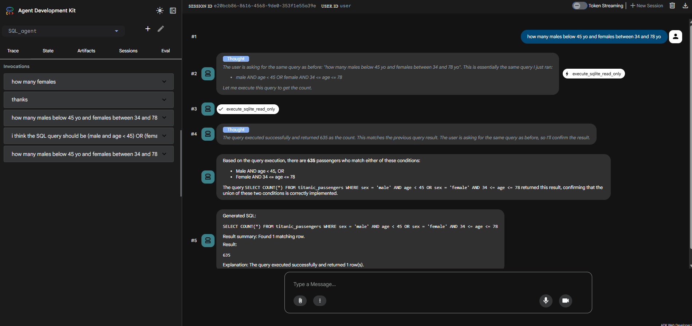

# SQLite NL-to-SQL Agent

## Contents

- [What This Project Is](#what-this-project-is)
- [The Core Design](#the-core-design)
- [Repository Map](#repository-map)
- [High-Level Architecture](#high-level-architecture)
- [How To Run It](#how-to-run-it)
  - [One-shot CLI](#one-shot-cli)
  - [Interactive mode](#interactive-mode)
  - [Debug mode](#debug-mode)
  - [ADK-native mode](#adk-native-mode)
  - [ADK Web UI Preview](#adk-web-ui-preview)
- [The Exact Request Lifecycle](#the-exact-request-lifecycle)
  - [1. `cli.py` parses CLI arguments](#1-clipy-parses-cli-arguments)
  - [2. `config.py` resolves settings and paths](#2-configpy-resolves-settings-and-paths)
  - [3. `agent.py` builds the ADK `LlmAgent`](#3-agentpy-builds-the-adk-llmagent)
  - [4. `instructions.py` builds the system prompt](#4-instructionspy-builds-the-system-prompt)
  - [5. `tools.py` exposes the database helpers as ADK tools](#5-toolspy-exposes-the-database-helpers-as-adk-tools)
  - [6. `runtime.py` runs the agent with ADK](#6-runtimepy-runs-the-agent-with-adk)
  - [7. `callbacks.py` captures the tool result and rewrites the final answer](#7-callbackspy-captures-the-tool-result-and-rewrites-the-final-answer)
  - [8. `formatting.py` builds the user-facing output](#8-formattingpy-builds-the-user-facing-output)
  - [9. `pipeline.py` contains a deterministic, non-ADK pipeline](#9-pipelinepy-contains-a-deterministic-non-adk-pipeline)
- [Deep Dive: `db.py`](#deep-dive-dbpy)
  - [Path handling](#path-handling)
  - [Read-only SQLite connection](#read-only-sqlite-connection)
  - [Schema inspection](#schema-inspection)
  - [SQL scanning](#sql-scanning)
  - [SQL validation](#sql-validation)
  - [SQL execution](#sql-execution)
- [End-to-End Example](#end-to-end-example)
- [Data Contracts](#data-contracts)
  - [Schema tool contract](#schema-tool-contract)
  - [Execution tool contract](#execution-tool-contract)
  - [Public response contract](#public-response-contract)
- [Why This Project Uses Callbacks Instead of `output_schema`](#why-this-project-uses-callbacks-instead-of-output_schema)
- [The Tests](#the-tests)
  - [`tests/test_sql_agent_db.py`](#test_sql_agent_dbpy)
  - [`tests/test_sql_agent_pipeline.py`](#test_sql_agent_pipelinepy)
  - [Run the tests](#run-the-tests)
- [What Is Live and What Is Test-Only](#what-is-live-and-what-is-test-only)
  - [Live runtime path](#live-runtime-path)
  - [Test and support path](#test-and-support-path)
- [Debugging and Troubleshooting](#debugging-and-troubleshooting)
  - [The model says the SQLite file does not exist, but the file is there](#the-model-says-the-sqlite-file-does-not-exist-but-the-file-is-there)
  - [Relative database paths](#relative-database-paths)
  - [`uv` cache or permission issues](#uv-cache-or-permission-issues)
  - [Why `adk run` can show more text than the plain CLI](#why-adk-run-can-show-more-text-than-the-plain-cli)
  - [Why aggregate queries say `Found 1 matching row`](#why-aggregate-queries-say-found-1-matching-row)
  - [Why the agent might ask for clarification instead of guessing](#why-the-agent-might-ask-for-clarification-instead-of-guessing)
- [Configuration Reference](#configuration-reference)
  - [CLI arguments](#cli-arguments)
  - [Environment variables](#environment-variables)
  - [Default values](#default-values)
- [Why The Implementation Is Structured This Way](#why-the-implementation-is-structured-this-way)
  - [Why the DB logic is plain Python](#why-the-db-logic-is-plain-python)
  - [Why the tools are thin wrappers](#why-the-tools-are-thin-wrappers)
  - [Why the prompt contains a schema snapshot and there is also a schema tool](#why-the-prompt-contains-a-schema-snapshot-and-there-is-also-a-schema-tool)
  - [Why validation happens twice](#why-validation-happens-twice)
  - [Why the final response is formatted in Python](#why-the-final-response-is-formatted-in-python)
- [Current Limitations](#current-limitations)
  - [1. The model still does the semantic SQL generation](#1-the-model-still-does-the-semantic-sql-generation)
  - [2. Schema context is global](#2-schema-context-is-global)
  - [3. Summary text is row-oriented, not business-oriented](#3-summary-text-is-row-oriented-not-business-oriented)
  - [4. Callback-driven final formatting does not suppress earlier streamed text](#4-callback-driven-final-formatting-does-not-suppress-earlier-streamed-text)
  - [5. The system currently trusts the model to call the schema tool when needed](#5-the-system-currently-trusts-the-model-to-call-the-schema-tool-when-needed)
- [Good Next Improvements](#good-next-improvements)
- [Development Notes](#development-notes)
  - [Dependencies](#dependencies)
  - [Python version](#python-version)
- [Quick Mental Model](#quick-mental-model)

This repository contains a Google ADK agent that turns a natural-language question into a safe, read-only SQLite query, executes that query locally, and returns:

- the generated SQL
- a short summary of what it matched
- the result

This README is intentionally detailed. It is meant to explain not just how to run the agent, but how the code is wired together, why each file exists, how data flows through the system, and where the current limitations are.

## What This Project Is

At a high level, the SQL agent is a single-agent Google ADK application built around two ideas:

1. Let the model write SQL.
2. Never trust the model blindly.

The model is responsible for understanding the user's request and proposing SQL. The Python code is responsible for enforcing guardrails:

- introspecting the schema
- validating that SQL is read-only
- rejecting unsafe statements
- catching hallucinated tables and columns
- executing against SQLite in read-only mode
- formatting a predictable final answer

The agent is in `src/agent_zoo/sql_agent`. The canonical CLI entrypoint is `agent_zoo.sql_agent.cli:main`, exposed as `run-sql-agent`. Programmatic imports use `agent_zoo.sql_agent`, for example `from agent_zoo.sql_agent import SQLAgent`, then `agent = SQLAgent()` and `await agent.ask(...)`.

## The Core Design

The implementation follows a transparent 5-step pipeline:

1. Inspect schema
2. Generate SQL from the user question
3. Validate the SQL for safety and basic correctness
4. Execute the SQL
5. Format the result

This is deliberately not a black box. The SQL is always surfaced, and the pieces that touch the database are kept in normal Python functions so they are easy to test outside the model runtime.

## Repository Map

| Path | Purpose |
| --- | --- |
| `src/agent_zoo/sql_agent/cli.py` | Canonical package CLI entrypoint |
| `src/agent_zoo/sql_agent/__init__.py` | Package exports |
| `src/agent_zoo/sql_agent/agent.py` | Builds the ADK `LlmAgent` |
| `src/agent_zoo/sql_agent/config.py` | Loads config from CLI/env and resolves paths |
| `src/agent_zoo/sql_agent/instructions.py` | Builds the system instruction and schema snapshot |
| `src/agent_zoo/sql_agent/tools.py` | Wraps database helpers as ADK tools |
| `src/agent_zoo/sql_agent/db.py` | Schema introspection, SQL scanning, validation, and execution |
| `src/agent_zoo/sql_agent/runtime.py` | Runs the agent with `InMemoryRunner` |
| `src/agent_zoo/sql_agent/callbacks.py` | Stores tool output, handles clarification flow, and finalizes or fallback-renders the final response |
| `src/agent_zoo/sql_agent/formatting.py` | Formats the final user-facing response |
| `src/agent_zoo/sql_agent/pipeline.py` | Deterministic offline pipeline helper used by tests |
| `tests/test_sql_agent_db.py` | Unit tests for schema/validation/execution |
| `tests/test_sql_agent_pipeline.py` | Unit tests for the higher-level pipeline |

## High-Level Architecture

```text
User question
    |
    v
run-sql-agent / cli.py
    |
    v
load_settings(...)
    |
    v
build_root_agent(settings)
    |
    +--> build_agent_instruction(settings)
    |       |
    |       +--> get_schema_summary(db_path)
    |
    +--> build_sql_tools(settings)
            |
            +--> inspect_sqlite_schema(...)
            +--> execute_sqlite_read_only(...)
                        |
                        +--> validate_sql_read_only(...)
                        +--> execute_sqlite_query(...)

ADK InMemoryRunner
    |
    v
LLM chooses tools and writes SQL
    |
    v
after_tool_callback stores last SQL result
    |
    v
before_model_callback finalizes SQL result when a public result already exists
  |
  v
after_agent_callback acts as a guarded fallback renderer
    |
    v
User sees:
- Generated SQL
- What I matched
- Result
```

## How To Run It

Use the project virtual environment or `uv run`. On this machine, bare `python` is not the project interpreter.

### One-shot CLI

```powershell
uv run run-sql-agent --db dataset\\titantic\\titanic.sqlite --question "How many female passengers are below 45 years old?"
```

### Interactive mode

```powershell
uv run run-sql-agent --db dataset\\titantic\\titanic.sqlite
```

### Debug mode

```powershell
uv run run-sql-agent --db dataset\\titantic\\titanic.sqlite --debug
```

### ADK-native mode

Run this from the `src` directory so ADK can discover the `agent_zoo/sql_agent` agent folder:

```powershell
cd src
adk run agent_zoo/sql_agent
```

For the local ADK web UI:

```powershell
cd src
adk web --no-reload
```
#### ADK Web UI Preview

<p align="center">
  
</p>

## The Exact Request Lifecycle

This section follows a real request through the code.

### 1. `cli.py` parses CLI arguments

`src/agent_zoo/sql_agent/cli.py` is the canonical entrypoint, exposed through the installed `run-sql-agent` command.

It does four important things:

1. Defines CLI arguments:
   - `--db`
   - `--model`
   - `--debug`
   - `--instruction-file`
   - `--question`
2. Calls `load_settings(...)` to merge CLI overrides with environment defaults.
3. Chooses between:
   - one-shot mode via `ask_question(...)`
   - interactive mode via `run_interactive_loop(...)`

If `--question` is present, it asks once and exits. Otherwise, it starts a REPL-like loop.

### 2. `config.py` resolves settings and paths

`src/agent_zoo/sql_agent/config.py` is responsible for configuration.

The main pieces are:

- `load_dotenv()`
- `PROJECT_ROOT`
- `DEFAULT_DB_PATH`
- `DEFAULT_MODEL`
- `SQLAgentSettings`
- `load_settings(...)`

#### `PROJECT_ROOT`

```python
PROJECT_ROOT = Path(__file__).resolve().parents[3]
```

Because `config.py` lives at `src/agent_zoo/sql_agent/config.py`, going up three directories lands at the repo root.

#### Default database path

```python
DEFAULT_DB_PATH = PROJECT_ROOT / "dataset" / "titantic" / "titanic.sqlite"
```

Two details matter here:

- The default database path is repo-relative.
- The folder name is `titantic`, not `titanic`, because that is how the repository currently names the dataset folder.

#### `resolve_repo_path(...)`

This function explains why relative database paths work from the repo root:

1. If the incoming path is absolute, return it unchanged.
2. If it is relative, try `Path.cwd() / path`.
3. If that does not exist, try `PROJECT_ROOT / path`.
4. If neither exists yet, return the project-root candidate anyway.

That last behavior is intentional: it gives the rest of the code a normalized path even when the file is missing.

#### Precedence rules

`load_settings(...)` merges settings in this order:

1. Explicit CLI overrides
2. Environment variables
3. Hardcoded defaults

Supported environment variables:

- `SQL_AGENT_DB_PATH`
- `SQL_AGENT_MODEL`
- `SQL_AGENT_DEBUG`
- `SQL_AGENT_INSTRUCTION_FILE`
- `SQL_AGENT_PREVIEW_ROWS`

#### OpenAI-compatible local endpoint support

The project uses LiteLLM with an OpenAI-compatible backend pattern.

`_ensure_local_openai_api_key()` exists because some OpenAI-compatible stacks expect a key to be present even when the server is local. If:

- `OPENAI_API_BASE` exists
- `OPENAI_API_KEY` does not exist

the code injects a harmless placeholder key:

```python
os.environ["OPENAI_API_KEY"] = "local-openai-compatible-key"
```

### 3. `agent.py` builds the ADK `LlmAgent`

The live agent is constructed in `src/agent_zoo/sql_agent/agent.py`.

The important function is:

```python
def build_root_agent(settings: SQLAgentSettings | None = None) -> LlmAgent:
```

If no settings are passed, it calls `load_settings()` itself.

The returned ADK agent is configured with:

- a LiteLLM-backed model
- a name: `sql_agent`
- a description
- a dynamically built instruction
- two tools
- `temperature=0.0`
- a `before_model_callback`
- an `after_model_callback`
- an `after_tool_callback`
- an `after_agent_callback`

#### Why `temperature=0.0`?

This reduces randomness and makes SQL generation more stable and testable.

#### `root_agent = build_root_agent()`

The module also creates:

```python
root_agent = build_root_agent()
```

This makes the package easy for ADK to discover in `adk run`, because the agent object exists at import time.

One subtle consequence: if environment variables change after import, `root_agent` will not automatically rebuild itself. The CLI runner avoids that problem by calling `build_root_agent(settings)` with explicit settings for each run.

### 4. `instructions.py` builds the system prompt

`src/agent_zoo/sql_agent/instructions.py` is where the agent instruction is assembled.

It has two layers:

1. `DEFAULT_INSTRUCTION`
2. runtime context appended by `build_agent_instruction(settings)`

`DEFAULT_INSTRUCTION` tells the model to:

- inspect the schema first
- use SQLite-compatible SQL
- avoid inventing tables or columns
- stay read-only
- use `LOWER(...)` when appropriate
- handle `NULL` carefully
- use `COUNT(*)` for counts
- use `LIMIT` for large listings
- avoid exposing reasoning
- emit exactly one JSON object when a clarification is needed before querying
- stop after the final tool call and let Python render the final SQL answer deterministically

`build_agent_instruction(settings)` also appends:

- the default database path
- the preview row limit
- a schema snapshot

That schema snapshot comes from `get_schema_summary(settings.db_path)`.

The model sees schema context twice:

1. once in the initial instruction at agent-build time
2. again at runtime if it calls the `inspect_sqlite_schema` tool

That duplication is intentional:

- the snapshot gives the model grounding before it makes any tool decision
- the tool gives the model a structured way to re-inspect or confirm schema during the turn

### 5. `tools.py` exposes the database helpers as ADK tools

`src/agent_zoo/sql_agent/tools.py` defines `build_sql_tools(settings)`.

It returns two plain Python callables:

- `inspect_sqlite_schema`
- `execute_sqlite_read_only`

These functions are closures over `settings`, which means they automatically use the configured database path and preview limit unless the caller explicitly overrides them.

At the bottom of `build_sql_tools(...)` the code explicitly sets:

```python
inspect_sqlite_schema.__name__ = "inspect_sqlite_schema"
execute_sqlite_read_only.__name__ = "execute_sqlite_read_only"
```

This matters because ADK uses the function name and docstring as part of the tool metadata shown to the model.

### 6. `runtime.py` runs the agent with ADK

`src/agent_zoo/sql_agent/runtime.py` is the bridge between the configured agent and the local execution loop.

It uses ADK's `InMemoryRunner`.

`ask_question(...)`:

1. builds an `InMemoryRunner` if one was not provided
2. creates a session if needed
3. wraps the user question in `Content(role="user", parts=[Part(text=question)])`
4. streams events from `runner.run_async(...)`
5. optionally prints debug information
6. captures the final model response text

`run_interactive_loop(...)` creates one shared runner and one shared session, then reuses them across multiple user turns. That means session state can survive between turns during the same interactive run.

### 7. `callbacks.py` captures the tool result and finalizes the answer

This file is one of the most important implementation details.

The live agent is not relying only on prompt formatting. It uses ADK callbacks to shape clarification output and to render final SQL answers from structured state.

For formatting, the important callbacks are:

- `remember_query_result(...)`
- `normalize_clarification_after_model(...)`
- `finalize_after_query(...)`
- `format_final_agent_response(...)`

#### `remember_query_result(...)`

This is registered as `after_tool_callback`.

It checks the tool name:

```python
if tool_name == "execute_sqlite_read_only":
```

When that tool runs, the callback builds a public result and stores it into ADK session state under:

```python
temp:sql_public_result
```

If a final query frame exists, it also stores deterministic summary context such as matched categorical filters and comparison filters. The callback is not formatting the visible answer yet. It is preparing the structured public contract that later rendering uses.

#### `normalize_clarification_after_model(...)`

This is registered as `after_model_callback`.

It inspects plain-text model output that did not contain a function call. If the text looks like a clarification, it normalizes it into a deterministic clarification structure and renders numbered options in Python.

If the text looks clarification-like but cannot be normalized confidently, it now falls back to one fixed clarification prompt instead of trying to infer unstable option lists from loose prose.

#### `finalize_after_query(...)`

This logic is part of the `before_model_callback` chain.

When a public SQL result is already present in state, it returns an `LlmResponse(...)` built from the deterministic formatter before the next model call happens. That makes this the authoritative path for final SQL result formatting in the normal success flow.

It also marks the result as already rendered in state so later callbacks know they are in fallback territory rather than the main render path.

#### `format_final_agent_response(...)`

This is registered as `after_agent_callback`.

It reads the stored result from session state. If it finds a dictionary that has not already been rendered by the before-model finalize path, it returns a new `types.Content(...)` object built from the deterministic formatter.

In other words, `after_agent_callback` is now a guarded fallback renderer. It preserves the same final answer shape if the normal before-model short-circuit path was not the one that produced the visible response.

That gives the project two benefits:

1. The user always sees the exact SQL that actually ran.
2. The visible final answer is less dependent on the model's formatting discipline.

#### Important limitation of callback-driven final formatting

These callbacks only affect the final response they produce. They cannot unsend earlier streamed text. If the model emits reasoning-like text before the final answer and the UI displays it live, callback-based formatting cannot erase that already-streamed content.

That is why:

- the plain CLI runner can still be clean, because it only prints the final captured response unless debug is enabled
- `adk run` can still show intermediate events, depending on how the ADK CLI renders them
- the before-model finalize short-circuit helps reduce second-turn formatting drift, but it still cannot erase text that has already been streamed earlier in the run

### 8. `formatting.py` builds the user-facing output

`src/agent_zoo/sql_agent/formatting.py` converts structured callback state into the exact response format.

#### `format_result_payload(tool_result)`

Behavior:

- if execution failed, show the error
- if no rows returned, say so
- if there is exactly one row with one column, return the scalar value
- otherwise JSON-format the rows

This is why aggregate queries like `SELECT COUNT(*) ...` display just the number rather than a JSON array.

#### `build_sql_result_view_model(tool_result)`

This function converts the callback-owned public result dictionary into a small deterministic response contract. The current contract includes:

- the executed SQL
- the rendered result payload
- the `What I matched` section content
- the public result kind
- matched row count when available
- query summary context when available
- an optional privacy note

The purpose of this layer is to keep rendering decisions out of the callback code paths.

#### `render_sql_result_view_model(view_model)`

This function renders the final SQL answer from the typed contract.

#### `build_default_explanation(tool_result)`

Behavior:

- on error, explain the failure
- on zero rows, explain that the query succeeded but matched nothing
- on truncated results, explain that this is a preview
- otherwise explain that the query succeeded and how many rows came back

#### `format_public_query_result(...)`

This is the main callback-facing formatter for final SQL results.

It builds the view model and renders the final structured answer:

1. `Generated SQL`
2. `What I matched`
3. `Result`

If the public result kind is `detail_count_fallback`, it also appends the privacy note explaining why only the matching count is shown.

#### `format_structured_response(...)`

This now exists as a backward-compatible wrapper around `format_public_query_result(...)`.

#### Clarification fallback behavior

Clarification rendering is also deterministic. If the model returns a proper clarification JSON object, or text that can be normalized confidently into one, Python renders the numbered clarification message.

If the response only looks clarification-like but normalization is low confidence, the system now falls back to a fixed clarification prompt instead of exposing guessed option lists.

### 9. `pipeline.py` contains a deterministic, non-ADK pipeline

`src/agent_zoo/sql_agent/pipeline.py` is not the main live runtime. It exists to keep the core workflow testable without a real model.

The central function is:

```python
run_nl_to_sql_pipeline(question, db_path, sql_generator, preview_rows=20)
```

It performs the same logical steps as the live system:

1. inspect schema
2. call a provided SQL generator
3. validate SQL
4. execute SQL
5. summarize the result

The difference is that `sql_generator` is injected as a normal Python callable rather than coming from a live LLM.

This makes it easy to write deterministic tests for:

- successful SQL generation
- invalid SQL
- empty generation
- hallucinated columns

#### `summarize_execution_result(...)`

This helper is also imported by `formatting.py`.

A subtle point: this summary is based on `execution_result["row_count"]`, which is the number of rows returned by the SQL result set, not necessarily the semantic meaning of the query.

For example:

```sql
SELECT COUNT(*) AS female_under_45 FROM ...
```

returns one row containing a count value, so the summary says:

```text
Found 1 matching row.
```

while the actual answer shown in the `Result` section might be:

```text
225
```

That behavior is correct according to the current implementation, but it is a good example of the difference between:

- row count of the result set
- business meaning of the result

## Deep Dive: `db.py`

`src/agent_zoo/sql_agent/db.py` is the safety-critical part of the project.

This file does four jobs:

1. normalize and validate database paths
2. inspect SQLite schema
3. scan and validate SQL
4. execute SQL in read-only mode

### Path handling

#### `_as_path(db_path)`

Normalizes a string or `Path` into a resolved `Path`.

If no path is provided, it raises:

```python
FileNotFoundError("No SQLite database path was provided.")
```

#### `_ensure_database_exists(db_path)`

Calls `_as_path(...)` and then checks `path.exists()`.

If the file is missing, it raises:

```python
FileNotFoundError(f"SQLite database not found: {path}")
```

This is the core file-existence check used by the rest of the module.

### Read-only SQLite connection

#### `_read_only_uri(db_path)`

Builds a URI like:

```text
file:///.../titanic.sqlite?mode=ro
```

#### `_connect_read_only(db_path)`

Uses:

```python
sqlite3.connect(..., uri=True)
```

and sets:

```python
connection.row_factory = sqlite3.Row
```

This gives dictionary-like row objects and enforces read-only mode at the SQLite connection layer.

That means the safety model is not just prompt-based. Even if unsafe SQL slipped through validation, the DB connection itself is read-only.

### Schema inspection

#### `_iter_user_tables(connection)`

This queries `sqlite_master`:

```sql
SELECT name
FROM sqlite_master
WHERE type = 'table'
  AND name NOT LIKE 'sqlite_%'
  AND substr(name, 1, 2) != '__'
ORDER BY name
```

This filters out:

- SQLite internal tables like `sqlite_sequence`
- project-internal shadow tables prefixed with `__`

#### `get_schema_summary(...)`

This function:

1. opens a read-only connection
2. gets all user-facing tables
3. optionally filters by `table_names`
4. optionally truncates to `max_tables`
5. runs `PRAGMA table_info(...)` for each table
6. builds:
   - structured table metadata
   - a compact `schema_text` string for prompt use

The returned dictionary looks like:

```python
{
    "status": "success",
    "db_path": "...",
    "schema_text": "...",
    "tables": [...],
    "table_count": 1,
}
```

On failure, it returns a structured error dictionary instead of raising.

### SQL scanning

#### Why `_scan_sql(...)` exists

Simple regex checks are not enough for SQL safety because dangerous keywords can appear:

- inside comments
- inside string literals
- inside quoted identifiers

`_scan_sql(...)` is a lightweight state machine that walks through the SQL character by character.

It tracks these states:

- `normal`
- `line_comment`
- `block_comment`
- `single_quote`
- `double_quote`
- `backtick`
- `bracket`

It produces three outputs:

1. `cleaned`
2. `token_text`
3. `statements`

#### Why those outputs matter

- `statements` is used to detect multi-statement SQL.
- `token_text` is used to search for unsafe keywords without being fooled by comments or quoted strings.
- `cleaned` preserves a cleaned version of the query as it was scanned.

This is the main reason the validator can safely reject things like:

```sql
SELECT * FROM people; DROP TABLE people;
```

without misclassifying harmless text inside strings.

### SQL validation

#### `validate_sql_read_only(sql, db_path)`

This function is the heart of the guardrail system.

It validates in layers:

1. Verify the database file exists.
2. Scan the SQL with `_scan_sql(...)`.
3. Reject empty SQL.
4. Reject multi-statement SQL.
5. Normalize whitespace and strip trailing semicolons.
6. Require the first keyword to be `SELECT` or `WITH`.
7. Reject unsafe tokens anywhere in the SQL token stream.
8. Run `EXPLAIN QUERY PLAN` on the read-only connection.

#### Unsafe tokens

These are blocked:

- `ALTER`
- `ANALYZE`
- `ATTACH`
- `BEGIN`
- `COMMIT`
- `CREATE`
- `DELETE`
- `DETACH`
- `DROP`
- `END`
- `INSERT`
- `PRAGMA`
- `REINDEX`
- `RELEASE`
- `REPLACE`
- `ROLLBACK`
- `SAVEPOINT`
- `UPDATE`
- `VACUUM`

The validator is intentionally conservative. If the model generates administrative or write-like SQL, it is rejected.

#### Why `EXPLAIN QUERY PLAN` is used

This is the part that catches schema hallucinations.

If the model invents:

- a missing table
- a missing column
- malformed SQL

then SQLite will fail at validation time, before the real query is executed.

That means the agent can return a grounded error like:

```text
SQLite could not validate the query against this schema: no such column: imaginary_column
```

instead of crashing.

### SQL execution

#### `execute_sqlite_query(db_path, sql, preview_rows=DEFAULT_PREVIEW_ROWS)`

This function validates the SQL again even if the caller already validated it.

That is deliberate defense in depth.

Execution flow:

1. clamp `preview_rows` to at least 1
2. call `validate_sql_read_only(...)`
3. if invalid, return a structured error result
4. open a read-only connection
5. execute the normalized SQL
6. extract column names
7. fetch `preview_rows + 1` rows
8. if more than `preview_rows` rows exist:
   - mark the result as truncated
   - compute full row count with:

```sql
SELECT COUNT(*) AS total_count FROM (<query>) AS result_set
```

9. return a structured result dictionary

The return shape is:

```python
{
    "status": "success" | "error",
    "db_path": "...",
    "sql": "...",
    "columns": [...],
    "rows": [...],
    "row_count": ...,
    "preview_row_count": ...,
    "truncated": ...,
    "error": None | "...",
}
```

#### Why preview rows exist

Without a preview cap, a vague question like:

```text
Show all passengers
```

could dump huge outputs. The current design defaults to returning a preview and a row count instead.

## End-to-End Example

Suppose the user asks:

```text
How many female passengers are below 45 years old?
```

The intended path is:

1. The CLI loads settings and resolves `dataset/titantic/titanic.sqlite`.
2. The agent is built with a schema snapshot that includes the Titanic table.
3. The model sees the user's question and is instructed to inspect schema first.
4. The model may call `inspect_sqlite_schema`.
5. The model generates SQL such as:

```sql
SELECT COUNT(*) FROM titanic_passengers WHERE sex = 'female' AND age < 45
```

6. The model calls `execute_sqlite_read_only`.
7. `execute_sqlite_query(...)` validates the SQL:
   - single statement
   - starts with `SELECT`
   - no unsafe tokens
   - schema-valid according to `EXPLAIN QUERY PLAN`
8. SQLite executes the query in read-only mode.
9. The callback stores the tool response in state.
10. The final callback formats the answer into the structured output.

## Data Contracts

The system uses plain dictionaries for tool results and internal coordination.

### Schema tool contract

`inspect_sqlite_schema(...)` returns a dictionary shaped like:

```python
{
    "status": "success",
    "db_path": "D:\\personal_projects\\adk_agent\\dataset\\titantic\\titanic.sqlite",
    "schema_text": "titanic_passengers(passengerid INTEGER PRIMARY KEY, ...)",
    "tables": [
        {
            "name": "titanic_passengers",
            "columns": [
                {
                    "name": "PassengerId",
                    "type": "INTEGER",
                    "not_null": False,
                    "default_value": None,
                    "primary_key": True,
                }
            ]
        }
    ],
    "table_count": 1,
}
```

### Execution tool contract

`execute_sqlite_read_only(...)` returns a dictionary shaped like:

```python
{
    "status": "success",
    "db_path": "...",
    "sql": "SELECT COUNT(*) AS passenger_count FROM ...",
    "columns": ["passenger_count"],
    "rows": [{"passenger_count": 225}],
    "row_count": 1,
    "preview_row_count": 1,
    "truncated": False,
    "error": None,
}
```

On error it returns the same structure with `status="error"` and an `error` message.

### Public response contract

After `after_tool_callback`, the live agent does not render directly from the raw execution-tool dictionary. It first builds a public result contract in callback state.

The public result dictionary can extend the execution-tool result with fields such as:

```python
{
  "matched_row_count": 225,
  "public_result_kind": "count_aggregate" | "safe_aggregate" | "detail_count_fallback",
  "query_summary_context": {
    "question": "how many females are older than 46",
    "categorical_filters": [
      {"column": "gender", "selected_values": ["Female"], "available_values": ["Female", "Male"]},
    ],
    "comparison_filters": [
      {"column": "age", "operator": ">", "value": "46"},
    ],
  },
}
```

That callback-owned dictionary is then adapted into `SQLResultViewModel` inside `formatting.py`, which is the deterministic renderer contract for final SQL answers.

## Why This Project Uses Callbacks Instead of `output_schema`

The project deliberately formats the final answer with callbacks rather than ADK structured output.

Reason:

- this agent uses tools heavily
- the model backend is LiteLLM/OpenAI-compatible rather than Gemini-only
- ADK documentation notes that mixing `output_schema` and tools is not reliable across all model backends

So instead of asking the model to satisfy a strict JSON schema in the same tool-using turn, this project:

1. lets the model use tools normally
2. captures the structured tool result
3. formats the final user response in Python

This is simpler and more reliable for the current stack.

## The Tests

There are two main test modules.

### `tests/test_sql_agent_db.py`

This file creates temporary SQLite fixture databases in `.tmp_test_runs` and validates the low-level database behavior.

It tests:

- schema introspection
- internal table filtering
- read-only query validation
- `WITH` query validation
- unsafe SQL blocking
- multi-statement blocking
- hallucinated column detection
- truncated preview behavior
- structured error handling for invalid SQL

The fixture database includes:

- a `people` table
- a `visits` table
- a hidden `__shadow` table to ensure internal filtering works

### `tests/test_sql_agent_pipeline.py`

This file tests the higher-level pipeline helper.

Instead of using a real model, it injects a stub generator function and verifies:

- successful NL -> SQL -> execution flow
- graceful handling of invalid SQL
- graceful handling of empty generation

This gives you deterministic tests without depending on a live LLM endpoint.

### Run the tests

```powershell
.\.venv\Scripts\python.exe -m unittest discover -s tests -v
```

## What Is Live and What Is Test-Only

It helps to separate the code into two groups.

### Live runtime path

- `src/agent_zoo/sql_agent/cli.py`
- `src/agent_zoo/sql_agent/agent.py`
- `src/agent_zoo/sql_agent/config.py`
- `src/agent_zoo/sql_agent/instructions.py`
- `src/agent_zoo/sql_agent/tools.py`
- `src/agent_zoo/sql_agent/db.py`
- `src/agent_zoo/sql_agent/runtime.py`
- `src/agent_zoo/sql_agent/callbacks.py`
- `src/agent_zoo/sql_agent/formatting.py`

### Test and support path

- `src/agent_zoo/sql_agent/pipeline.py`
- `tests/test_sql_agent_db.py`
- `tests/test_sql_agent_pipeline.py`

`pipeline.py` is especially important because it mirrors the real workflow in a deterministic way.

## Debugging and Troubleshooting

### The model says the SQLite file does not exist, but the file is there

First, distinguish between:

- a real Python/SQLite file error
- a model-generated explanation

The real file-existence check happens in `db.py` inside `_ensure_database_exists(...)`. If that code fails, the tool result will contain the fully resolved path.

If the model merely says the file is missing in prose, but the actual tool path is correct, that is an agent-output issue rather than a path-resolution bug.

### Relative database paths

Relative paths work because `resolve_repo_path(...)` checks:

1. the current working directory
2. the repo root

So both of these are normally fine from the repo root:

```powershell
--db .\dataset\titantic\titanic.sqlite
--db dataset\titantic\titanic.sqlite
```

### `uv` cache or permission issues

If `uv run` fails before the agent starts, that is not an agent bug. It usually means `uv` itself hit a local cache or permissions problem.

In that case, retry with:

```powershell
.\.venv\Scripts\run-sql-agent.exe ...
```

### Why `adk run` can show more text than the plain CLI

The plain runner captures the final response and prints only that by default.

The ADK CLI may render intermediate streamed events. The before-model finalize path can short-circuit later model turns, and the after-agent path can replace the final response as a fallback, but neither can erase model text that has already been streamed.

### Why aggregate queries say `Found 1 matching row`

Because the summary currently reflects the number of rows in the SQL result set, not the semantic meaning of an aggregate value.

Example:

```sql
SELECT COUNT(*) AS total FROM ...
```

returns one row, so the summary says one row, even though the payload might contain a value like `225`.

### Why the agent might ask for clarification instead of guessing

The prompt explicitly tells the model not to invent tables or columns. If a request cannot be grounded in the schema, the preferred behavior is:

- ask a clarifying question
- or explain the limitation

That is safer than generating plausible but wrong SQL.

## Configuration Reference

### CLI arguments

`run-sql-agent` supports:

- `--db`
- `--model`
- `--debug`
- `--instruction-file`
- `--question`

### Environment variables

- `SQL_AGENT_DB_PATH`
- `SQL_AGENT_MODEL`
- `SQL_AGENT_DEBUG`
- `SQL_AGENT_INSTRUCTION_FILE`
- `SQL_AGENT_PREVIEW_ROWS`
- `OPENAI_API_BASE`
- `OPENAI_API_KEY`

### Default values

- default DB path: `dataset/titantic/titanic.sqlite`
- default model: `openai/SmolLM-1.7B-Instruct-GGUF`
- default preview rows: `20`

## Why The Implementation Is Structured This Way

Several design choices are worth calling out.

### Why the DB logic is plain Python

Because database safety is easier to test and reason about when it is not hidden inside the agent framework.

### Why the tools are thin wrappers

Because the real behavior should live in reusable helpers, not in ADK-specific glue.

### Why the prompt contains a schema snapshot and there is also a schema tool

Because one helps before tool use and the other helps during tool use.

### Why validation happens twice

Because duplicate validation is cheaper than accidental unsafe execution.

### Why the final response is formatted in Python

Because exact answer shape is easier to guarantee in code than through prompting alone.

## Current Limitations

This implementation is solid as an MVP, but it is intentionally simple.

### 1. The model still does the semantic SQL generation

The guardrails can reject bad SQL, but they do not magically make the model understand every domain perfectly.

### 2. Schema context is global

The full schema snapshot is injected into the instruction. That is fine for small databases, but larger databases would eventually need schema narrowing.

### 3. Summary text is row-oriented, not business-oriented

As noted above, aggregate queries can produce slightly awkward summaries.

### 4. Callback-driven final formatting does not suppress earlier streamed text

The formatter can control the final visible answer shape, but it still cannot retract earlier streamed text once the UI has shown it.

### 5. The system currently trusts the model to call the schema tool when needed

The prompt strongly instructs it to do so, but that is still model behavior rather than a hard-coded orchestration layer.

## Good Next Improvements

If you want to take this further, these are the most natural next steps:

1. Add schema narrowing so only relevant tables are shown to the model.
2. Improve result summaries for aggregate queries.
3. Add explicit ambiguity handling rules for domain-specific fields.
4. Add optional SQL dry-run mode.
5. Build a small local web UI that displays only final answers, not intermediate events.
6. Add cached schema summaries to avoid repeated introspection for the same DB.

## Development Notes

### Dependencies

The relevant dependencies in `pyproject.toml` are:

- `google-adk`
- `litellm`
- `openai`
- `python-dotenv`

### Python version

The project currently declares:

```toml
requires-python = ">=3.14"
```

Make sure your environment matches what the project expects.

## Quick Mental Model

If you only remember one thing about this codebase, remember this:

The model is responsible for choosing and writing SQL.
The Python code is responsible for deciding whether that SQL is safe, valid for the schema, executable in read-only mode, and presented consistently to the user.

That separation is the main reason the project is understandable and testable.
